# AIMS System - UML Diagrams

## Mục lục
1. [Use Case 1: Place Order](#use-case-1-place-order)
2. [Use Case 2: Add Product to Cart](#use-case-2-add-product-to-cart)
3. [Use Case 3: Pay Order (VietQR)](#use-case-3-pay-order-vietqr)
4. [Use Case 4: Pay Order by Credit Card](#use-case-4-pay-order-by-credit-card)
5. [Use Case 5: Select Delivery Method](#use-case-5-select-delivery-method)
6. [Use Case 6: View Product Details](#use-case-6-view-product-details)
7. [Use Case 7: Search Products](#use-case-7-search-products)
8. [Use Case 8: Create Product](#use-case-8-create-product)
9. [Use Case 9: Update Product](#use-case-9-update-product)
10. [Use Case 10: Delete Product](#use-case-10-delete-product)
11. [Use Case 11: Log In](#use-case-11-log-in)
12. [Use Case 12: Log Out](#use-case-12-log-out)

---

## Unified Analysis Class Diagram (Toàn hệ thống)

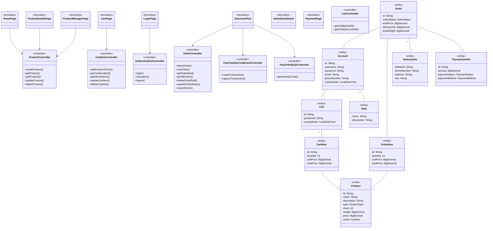

---

## Use Case 1: Place Order

### 1.1 Sequence Diagram

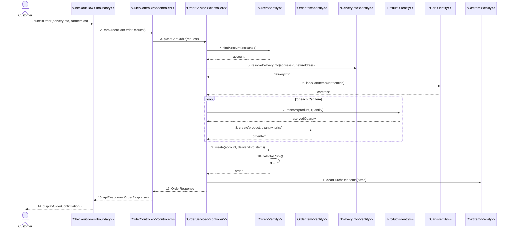

### 1.2 Analysis Class Diagram

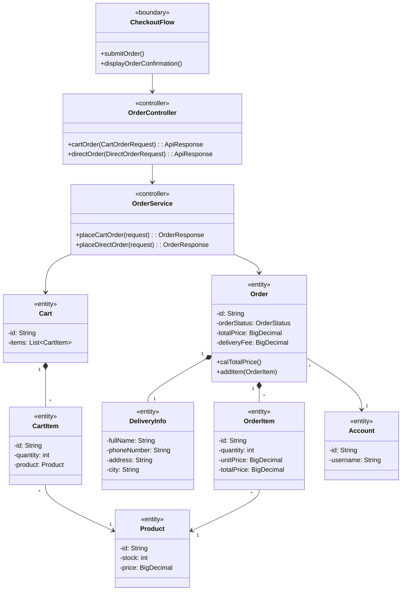

### 1.3 Communication Diagram

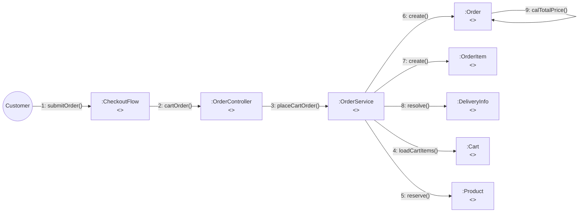

---

## Use Case 2: Add Product to Cart

### 2.1 Sequence Diagram

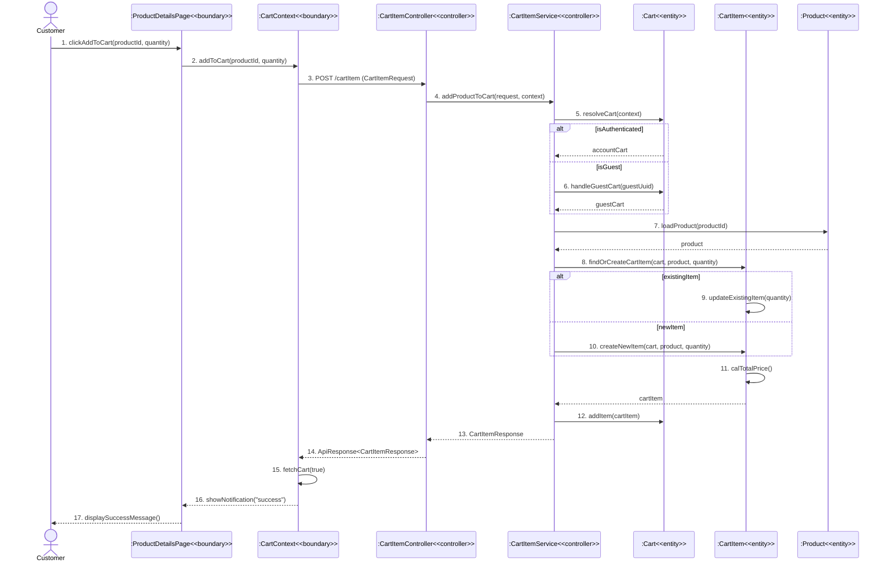

### 2.2 Analysis Class Diagram

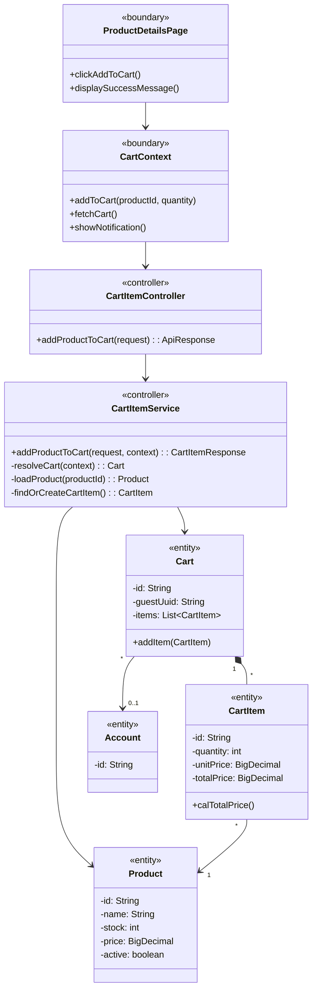

### 2.3 Communication Diagram

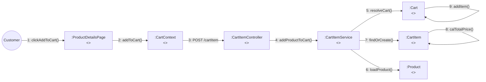

---

## Use Case 3: Pay Order (VietQR)

### 3.1 Sequence Diagram

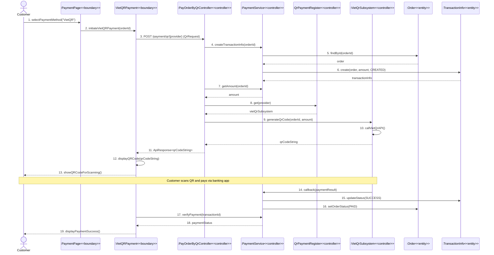

### 3.2 Analysis Class Diagram

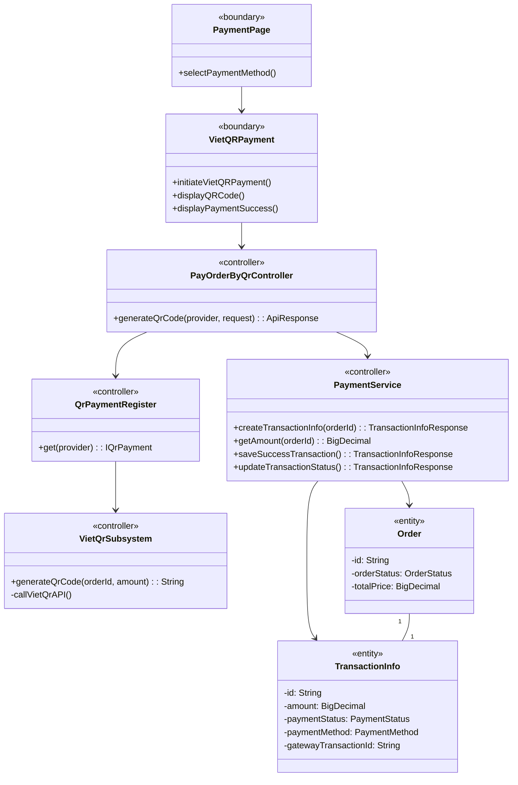

### 3.3 Communication Diagram

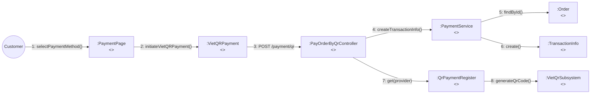

---

## Use Case 4: Pay Order by Credit Card

### 4.1 Sequence Diagram

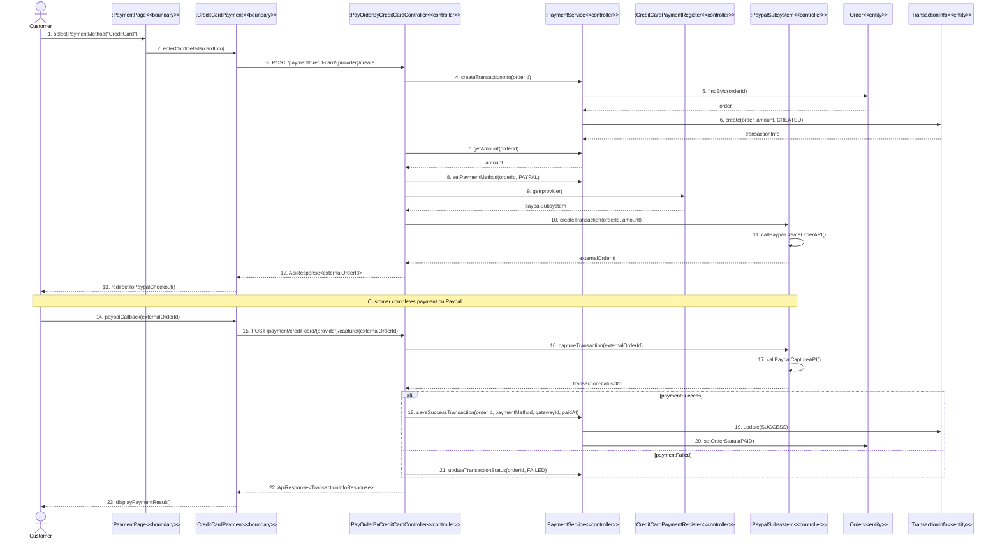

### 4.2 Analysis Class Diagram

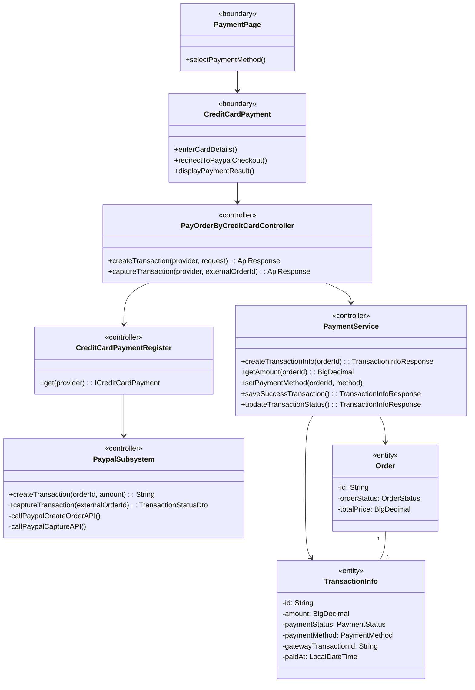

### 4.3 Communication Diagram

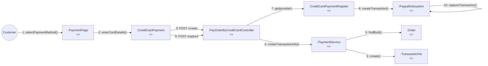

---

## Use Case 5: Select Delivery Method

### 5.1 Sequence Diagram

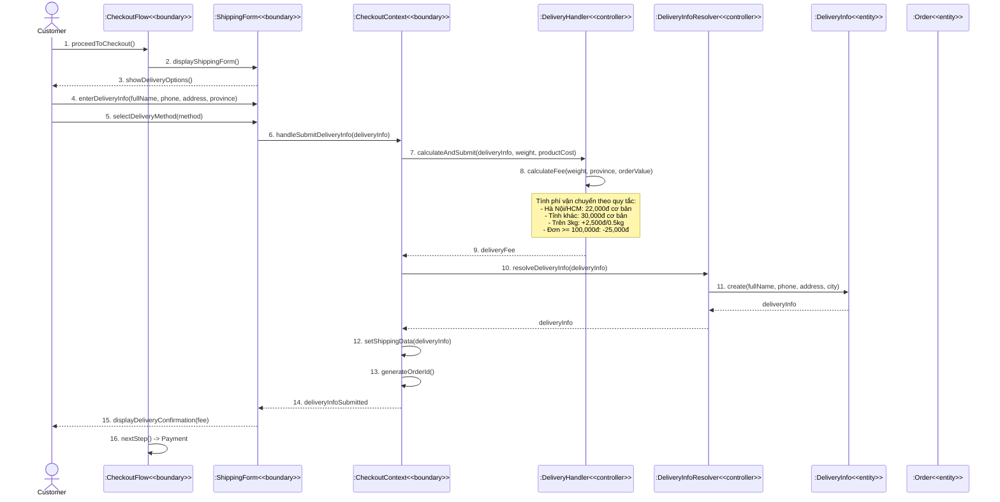

### 5.2 Analysis Class Diagram

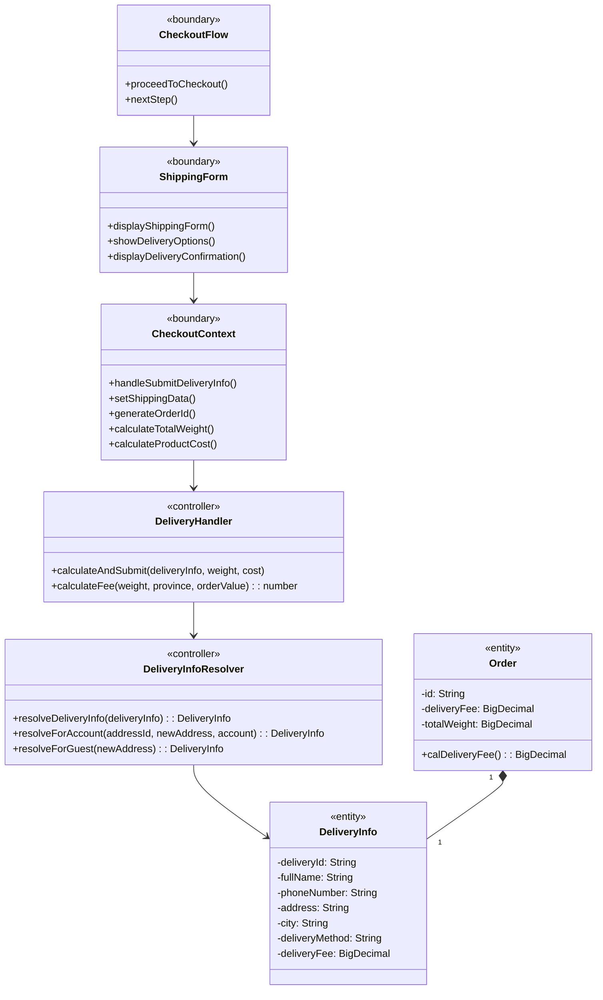

### 5.3 Communication Diagram

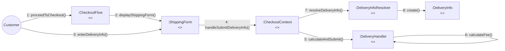

---

## Use Case 6: View Product Details

### 6.1 Sequence Diagram

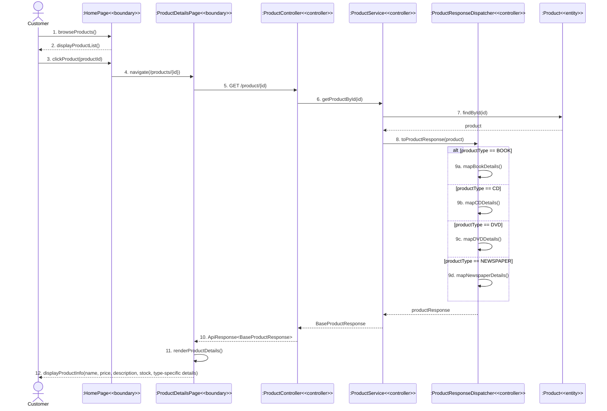

### 6.2 Analysis Class Diagram

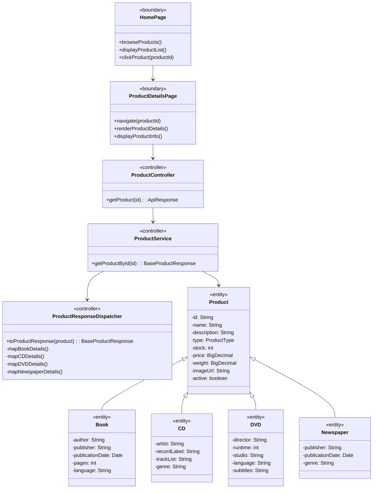

### 6.3 Communication Diagram

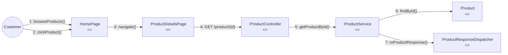

---

## Use Case 7: Search Products

### 7.1 Sequence Diagram

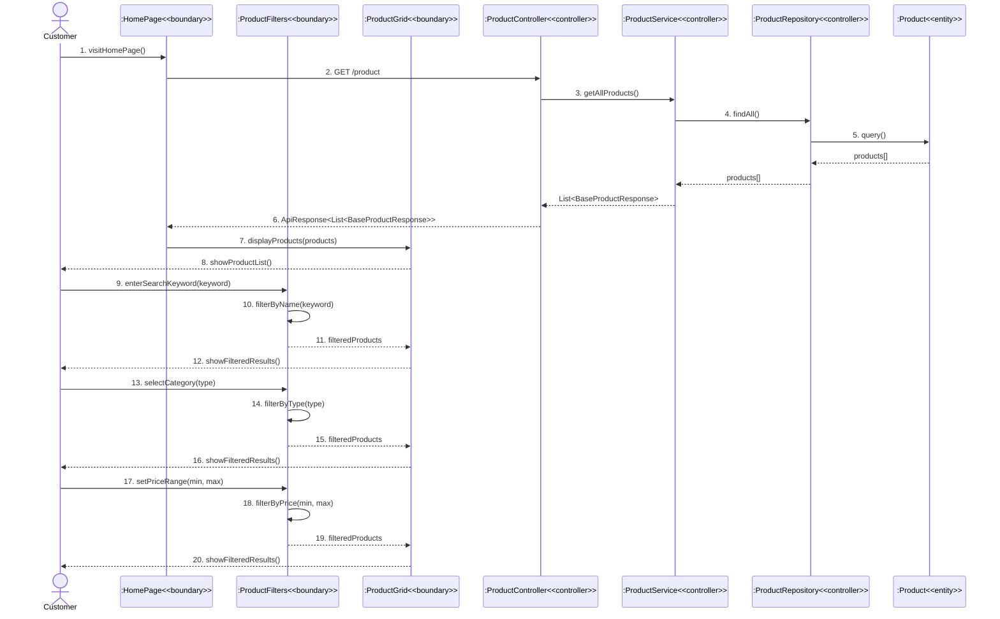

### 7.2 Analysis Class Diagram

```mermaid
classDiagram
    class HomePage {
        <<boundary>>
        +visitHomePage()
        +loadProducts()
    }
    class ProductFilters {
        <<boundary>>
        +enterSearchKeyword(keyword)
        +selectCategory(type)
        +setPriceRange(min, max)
        -filterByName(keyword)
        -filterByType(type)
        -filterByPrice(min, max)
    }
    class ProductGrid {
        <<boundary>>
        +displayProducts(products)
        +showProductList()
        +showFilteredResults()
    }
    class ProductController {
        <<controller>>
        +getProducts(): ApiResponse
    }
    class ProductService {
        <<controller>>
        +getAllProducts(): List~BaseProductResponse~
    }
    class ProductRepository {
        <<controller>>
        +findAll(): List~Product~
        +findByType(type): List~Product~
        +findByNameContaining(keyword): List~Product~
    }
    class Product {
        <<entity>>
        -id: String
        -name: String
        -type: ProductType
        -price: BigDecimal
        -stock: int
        -active: boolean
    }

    HomePage --> ProductFilters
    HomePage --> ProductGrid
    HomePage --> ProductController
    ProductFilters --> ProductGrid
    ProductController --> ProductService
    ProductService --> ProductRepository
    ProductRepository --> Product
```

### 7.3 Communication Diagram

```mermaid
flowchart LR
    Customer((Customer))
    HomePage[":HomePage\n<<boundary>>"]
    ProductFilters[":ProductFilters\n<<boundary>>"]
    ProductGrid[":ProductGrid\n<<boundary>>"]
    ProductController[":ProductController\n<<controller>>"]
    ProductService[":ProductService\n<<controller>>"]
    ProductRepository[":ProductRepository\n<<controller>>"]
    Product[":Product\n<<entity>>"]

    Customer -->|"1: visitHomePage()"| HomePage
    HomePage -->|"2: GET /product"| ProductController
    ProductController -->|"3: getAllProducts()"| ProductService
    ProductService -->|"4: findAll()"| ProductRepository
    ProductRepository -->|"5: query()"| Product
    HomePage -->|"6: displayProducts()"| ProductGrid
    Customer -->|"7: enterSearchKeyword()"| ProductFilters
    ProductFilters -->|"8: filterByName()"| ProductFilters
    ProductFilters -->|"9: filteredProducts"| ProductGrid
```

---

## Use Case 8: Create Product

### 8.1 Sequence Diagram

```mermaid
sequenceDiagram
    actor ProductManager
    participant ProductManagerPage as :ProductManagerPage<<boundary>>
    participant ProductForm as :ProductForm<<boundary>>
    participant ProductController as :ProductController<<controller>>
    participant ProductService as :ProductService<<controller>>
    participant ProductCreateDispatcher as :ProductCreateDispatcher<<controller>>
    participant ProductRepository as :ProductRepository<<controller>>
    participant Product as :Product<<entity>>

    ProductManager->>ProductManagerPage: 1. clickCreateProduct()
    ProductManagerPage->>ProductForm: 2. openProductForm(mode="create")
    ProductForm-->>ProductManager: 3. displayEmptyForm()
    
    ProductManager->>ProductForm: 4. fillProductDetails(name, description, type, price, stock, weight)
    ProductManager->>ProductForm: 5. fillTypeSpecificDetails(bookDetails/cdDetails/dvdDetails)
    ProductManager->>ProductForm: 6. uploadImage(imageFile)
    ProductManager->>ProductForm: 7. submitForm()
    
    ProductForm->>ProductController: 8. POST /product (BaseProductRequest)
    ProductController->>ProductService: 9. createProduct(productRequest)
    
    ProductService->>ProductRepository: 10. existsByName(name)
    ProductRepository-->>ProductService: exists
    
    alt productExists
        ProductService-->>ProductController: 11a. throw WebException(PRODUCT_EXISTED)
        ProductController-->>ProductForm: 12a. ApiResponse(error)
        ProductForm-->>ProductManager: 13a. showError("Product already exists")
    else productNotExists
        ProductService->>ProductCreateDispatcher: 11b. create(productRequest)
        
        alt type == BOOK
            ProductCreateDispatcher->>Product: 12b. createBook(request)
        else type == CD
            ProductCreateDispatcher->>Product: 12c. createCD(request)
        else type == DVD
            ProductCreateDispatcher->>Product: 12d. createDVD(request)
        else type == NEWSPAPER
            ProductCreateDispatcher->>Product: 12e. createNewspaper(request)
        end
        
        Product-->>ProductCreateDispatcher: product
        ProductCreateDispatcher-->>ProductService: product
        
        ProductService->>ProductRepository: 13. save(product)
        ProductRepository-->>ProductService: savedProduct
        
        ProductService-->>ProductController: 14. BaseProductResponse
        ProductController-->>ProductForm: 15. ApiResponse<BaseProductResponse>
        ProductForm-->>ProductManager: 16. showSuccess("Product created successfully")
        ProductManagerPage->>ProductManagerPage: 17. refreshProductList()
    end
```

### 8.2 Analysis Class Diagram

```mermaid
classDiagram
    class ProductManagerPage {
        <<boundary>>
        +clickCreateProduct()
        +refreshProductList()
    }
    class ProductForm {
        <<boundary>>
        +openProductForm(mode)
        +displayEmptyForm()
        +fillProductDetails()
        +fillTypeSpecificDetails()
        +uploadImage()
        +submitForm()
        +showSuccess()
        +showError()
    }
    class ProductController {
        <<controller>>
        +createProduct(request): ApiResponse
    }
    class ProductService {
        <<controller>>
        +createProduct(request): BaseProductResponse
    }
    class ProductCreateDispatcher {
        <<controller>>
        +create(request): Product
        -createBook(request): Book
        -createCD(request): CD
        -createDVD(request): DVD
        -createNewspaper(request): Newspaper
    }
    class ProductRepository {
        <<controller>>
        +existsByName(name): boolean
        +save(product): Product
    }
    class Product {
        <<entity>>
        -id: String
        -name: String
        -description: String
        -type: ProductType
        -stock: int
        -price: BigDecimal
        -weight: BigDecimal
        -imageUrl: String
        -createdDate: LocalDateTime
        -active: boolean
    }

    ProductManagerPage --> ProductForm
    ProductForm --> ProductController
    ProductController --> ProductService
    ProductService --> ProductCreateDispatcher
    ProductService --> ProductRepository
    ProductCreateDispatcher --> Product
    ProductRepository --> Product
```

### 8.3 Communication Diagram

```mermaid
flowchart LR
    ProductManager((ProductManager))
    ProductManagerPage[":ProductManagerPage\n<<boundary>>"]
    ProductForm[":ProductForm\n<<boundary>>"]
    ProductController[":ProductController\n<<controller>>"]
    ProductService[":ProductService\n<<controller>>"]
    ProductCreateDispatcher[":ProductCreateDispatcher\n<<controller>>"]
    ProductRepository[":ProductRepository\n<<controller>>"]
    Product[":Product\n<<entity>>"]

    ProductManager -->|"1: clickCreateProduct()"| ProductManagerPage
    ProductManagerPage -->|"2: openProductForm()"| ProductForm
    ProductManager -->|"3: fillProductDetails()"| ProductForm
    ProductForm -->|"4: POST /product"| ProductController
    ProductController -->|"5: createProduct()"| ProductService
    ProductService -->|"6: existsByName()"| ProductRepository
    ProductService -->|"7: create()"| ProductCreateDispatcher
    ProductCreateDispatcher -->|"8: createProduct()"| Product
    ProductService -->|"9: save()"| ProductRepository
```

---

## Use Case 9: Update Product

### 9.1 Sequence Diagram

```mermaid
sequenceDiagram
    actor ProductManager
    participant ProductManagerPage as :ProductManagerPage<<boundary>>
    participant ProductForm as :ProductForm<<boundary>>
    participant ProductController as :ProductController<<controller>>
    participant ProductService as :ProductService<<controller>>
    participant ProductUpdateDispatcher as :ProductUpdateDispatcher<<controller>>
    participant ProductRepository as :ProductRepository<<controller>>
    participant Product as :Product<<entity>>

    ProductManager->>ProductManagerPage: 1. selectProduct(productId)
    ProductManagerPage->>ProductController: 2. GET /product/{id}
    ProductController->>ProductService: 3. getProductById(id)
    ProductService->>ProductRepository: 4. findById(id)
    ProductRepository-->>ProductService: product
    ProductService-->>ProductController: BaseProductResponse
    ProductController-->>ProductManagerPage: 5. ApiResponse<BaseProductResponse>
    
    ProductManagerPage->>ProductForm: 6. openProductForm(mode="edit", product)
    ProductForm-->>ProductManager: 7. displayFilledForm(productDetails)
    
    ProductManager->>ProductForm: 8. modifyProductDetails(name, price, stock, etc.)
    ProductManager->>ProductForm: 9. submitForm()
    
    ProductForm->>ProductController: 10. PUT /product/{id} (BaseProductRequest)
    ProductController->>ProductService: 11. updateProduct(id, productRequest)
    
    ProductService->>ProductRepository: 12. findById(id)
    ProductRepository-->>ProductService: existingProduct
    
    alt productNotFound
        ProductService-->>ProductController: 13a. throw WebException(PRODUCT_NOT_FOUND)
        ProductController-->>ProductForm: 14a. ApiResponse(error)
        ProductForm-->>ProductManager: 15a. showError("Product not found")
    else productFound
        ProductService->>ProductUpdateDispatcher: 13b. updateProduct(request, existingProduct)
        
        ProductUpdateDispatcher->>Product: 14b. updateFields(name, description, price, stock, weight)
        
        alt type == BOOK
            ProductUpdateDispatcher->>Product: 15b. updateBookFields()
        else type == CD
            ProductUpdateDispatcher->>Product: 15c. updateCDFields()
        else type == DVD
            ProductUpdateDispatcher->>Product: 15d. updateDVDFields()
        else type == NEWSPAPER
            ProductUpdateDispatcher->>Product: 15e. updateNewspaperFields()
        end
        
        Product->>Product: 16. setActive(true)
        Product->>Product: 17. setLastModifiedDate(now)
        
        ProductService->>ProductRepository: 18. save(product)
        ProductRepository-->>ProductService: updatedProduct
        
        ProductService-->>ProductController: 19. BaseProductResponse
        ProductController-->>ProductForm: 20. ApiResponse<BaseProductResponse>
        ProductForm-->>ProductManager: 21. showSuccess("Product updated successfully")
        ProductManagerPage->>ProductManagerPage: 22. refreshProductList()
    end
```

### 9.2 Analysis Class Diagram

```mermaid
classDiagram
    class ProductManagerPage {
        <<boundary>>
        +selectProduct(productId)
        +refreshProductList()
    }
    class ProductForm {
        <<boundary>>
        +openProductForm(mode, product)
        +displayFilledForm()
        +modifyProductDetails()
        +submitForm()
        +showSuccess()
        +showError()
    }
    class ProductController {
        <<controller>>
        +getProduct(id): ApiResponse
        +updateProduct(id, request): ApiResponse
    }
    class ProductService {
        <<controller>>
        +getProductById(id): BaseProductResponse
        +updateProduct(id, request): BaseProductResponse
    }
    class ProductUpdateDispatcher {
        <<controller>>
        +updateProduct(request, product)
        -updateBookFields()
        -updateCDFields()
        -updateDVDFields()
        -updateNewspaperFields()
    }
    class ProductRepository {
        <<controller>>
        +findById(id): Optional~Product~
        +save(product): Product
    }
    class Product {
        <<entity>>
        -id: String
        -name: String
        -description: String
        -type: ProductType
        -stock: int
        -price: BigDecimal
        -weight: BigDecimal
        -lastModifiedDate: LocalDateTime
        -active: boolean
        +setActive(boolean)
        +setLastModifiedDate(LocalDateTime)
    }

    ProductManagerPage --> ProductForm
    ProductForm --> ProductController
    ProductController --> ProductService
    ProductService --> ProductUpdateDispatcher
    ProductService --> ProductRepository
    ProductUpdateDispatcher --> Product
    ProductRepository --> Product
```

### 9.3 Communication Diagram

```mermaid
flowchart LR
    ProductManager((ProductManager))
    ProductManagerPage[":ProductManagerPage\n<<boundary>>"]
    ProductForm[":ProductForm\n<<boundary>>"]
    ProductController[":ProductController\n<<controller>>"]
    ProductService[":ProductService\n<<controller>>"]
    ProductUpdateDispatcher[":ProductUpdateDispatcher\n<<controller>>"]
    ProductRepository[":ProductRepository\n<<controller>>"]
    Product[":Product\n<<entity>>"]

    ProductManager -->|"1: selectProduct()"| ProductManagerPage
    ProductManagerPage -->|"2: GET /product/{id}"| ProductController
    ProductController -->|"3: getProductById()"| ProductService
    ProductService -->|"4: findById()"| ProductRepository
    ProductManagerPage -->|"5: openProductForm()"| ProductForm
    ProductManager -->|"6: modifyProductDetails()"| ProductForm
    ProductForm -->|"7: PUT /product/{id}"| ProductController
    ProductController -->|"8: updateProduct()"| ProductService
    ProductService -->|"9: updateProduct()"| ProductUpdateDispatcher
    ProductUpdateDispatcher -->|"10: updateFields()"| Product
    ProductService -->|"11: save()"| ProductRepository
```

---

## Use Case 10: Delete Product

### 10.1 Sequence Diagram

```mermaid
sequenceDiagram
    actor ProductManager
    participant ProductManagerPage as :ProductManagerPage<<boundary>>
    participant ConfirmDialog as :ConfirmDialog<<boundary>>
    participant ProductController as :ProductController<<controller>>
    participant ProductService as :ProductService<<controller>>
    participant ProductRepository as :ProductRepository<<controller>>
    participant Product as :Product<<entity>>

    ProductManager->>ProductManagerPage: 1. selectProduct(productId)
    ProductManager->>ProductManagerPage: 2. clickDeleteProduct()
    
    ProductManagerPage->>ConfirmDialog: 3. showConfirmation("Are you sure you want to delete this product?")
    ConfirmDialog-->>ProductManager: 4. displayConfirmDialog()
    
    alt userCancels
        ProductManager->>ConfirmDialog: 5a. clickCancel()
        ConfirmDialog-->>ProductManagerPage: 6a. cancelled
        ProductManagerPage-->>ProductManager: 7a. returnToProductList()
    else userConfirms
        ProductManager->>ConfirmDialog: 5b. clickConfirm()
        ConfirmDialog->>ProductManagerPage: 6b. confirmed
        
        ProductManagerPage->>ProductController: 7b. DELETE /product/{id}
        ProductController->>ProductService: 8. deleteProduct(id)
        
        ProductService->>ProductRepository: 9. findById(id)
        ProductRepository-->>ProductService: product
        
        alt productNotFound
            ProductService-->>ProductController: 10a. throw WebException(PRODUCT_NOT_FOUND)
            ProductController-->>ProductManagerPage: 11a. ApiResponse(error)
            ProductManagerPage-->>ProductManager: 12a. showError("Product not found")
        else productFound
            Note over ProductService,Product: Soft delete - chỉ đánh dấu inactive<br/>không xóa khỏi database
            ProductService->>Product: 10b. setActive(false)
            ProductService->>ProductRepository: 11b. save(product)
            ProductRepository-->>ProductService: savedProduct
            
            ProductService-->>ProductController: 12b. "Product deleted Successfully!"
            ProductController-->>ProductManagerPage: 13. ApiResponse<String>
            ProductManagerPage-->>ProductManager: 14. showSuccess("Product deleted successfully")
            ProductManagerPage->>ProductManagerPage: 15. refreshProductList()
        end
    end
```

### 10.2 Analysis Class Diagram

```mermaid
classDiagram
    class ProductManagerPage {
        <<boundary>>
        +selectProduct(productId)
        +clickDeleteProduct()
        +refreshProductList()
        +showSuccess()
        +showError()
    }
    class ConfirmDialog {
        <<boundary>>
        +showConfirmation(message)
        +displayConfirmDialog()
        +clickConfirm()
        +clickCancel()
    }
    class ProductController {
        <<controller>>
        +deleteProduct(id): ApiResponse
    }
    class ProductService {
        <<controller>>
        +deleteProduct(id)
    }
    class ProductRepository {
        <<controller>>
        +findById(id): Optional~Product~
        +save(product): Product
    }
    class Product {
        <<entity>>
        -id: String
        -name: String
        -active: boolean
        +setActive(boolean)
    }

    ProductManagerPage --> ConfirmDialog
    ProductManagerPage --> ProductController
    ProductController --> ProductService
    ProductService --> ProductRepository
    ProductRepository --> Product
```

### 10.3 Communication Diagram

```mermaid
flowchart LR
    ProductManager((ProductManager))
    ProductManagerPage[":ProductManagerPage\n<<boundary>>"]
    ConfirmDialog[":ConfirmDialog\n<<boundary>>"]
    ProductController[":ProductController\n<<controller>>"]
    ProductService[":ProductService\n<<controller>>"]
    ProductRepository[":ProductRepository\n<<controller>>"]
    Product[":Product\n<<entity>>"]

    ProductManager -->|"1: selectProduct()"| ProductManagerPage
    ProductManager -->|"2: clickDeleteProduct()"| ProductManagerPage
    ProductManagerPage -->|"3: showConfirmation()"| ConfirmDialog
    ProductManager -->|"4: clickConfirm()"| ConfirmDialog
    ConfirmDialog -->|"5: confirmed"| ProductManagerPage
    ProductManagerPage -->|"6: DELETE /product/{id}"| ProductController
    ProductController -->|"7: deleteProduct()"| ProductService
    ProductService -->|"8: findById()"| ProductRepository
    ProductService -->|"9: setActive(false)"| Product
    ProductService -->|"10: save()"| ProductRepository
```

---

## Use Case 11: Log In

### 11.1 Sequence Diagram

```mermaid
sequenceDiagram
    actor User
    participant LoginPage as :LoginPage<<boundary>>
    participant LoginForm as :LoginForm<<boundary>>
    participant AuthenticationController as :AuthenticationController<<controller>>
    participant AuthenticationService as :AuthenticationService<<controller>>
    participant AccountRepository as :AccountRepository<<controller>>
    participant Account as :Account<<entity>>
    participant InvalidatedToken as :InvalidatedToken<<entity>>

    User->>LoginPage: 1. navigateToLogin()
    LoginPage->>LoginForm: 2. displayLoginForm()
    LoginForm-->>User: 3. showUsernamePasswordFields()
    
    User->>LoginForm: 4. enterCredentials(username, password)
    User->>LoginForm: 5. clickLogin()
    
    LoginForm->>AuthenticationController: 6. POST /auth/token (AuthenticationRequest)
    AuthenticationController->>AuthenticationService: 7. authenticate(request)
    
    AuthenticationService->>AccountRepository: 8. findByUsername(username)
    AccountRepository->>Account: 9. query(username)
    Account-->>AccountRepository: account
    AccountRepository-->>AuthenticationService: account
    
    alt accountNotFound
        AuthenticationService-->>AuthenticationController: 10a. throw WebException(ACCOUNT_NOT_EXIST)
        AuthenticationController-->>LoginForm: 11a. ApiResponse(error)
        LoginForm-->>User: 12a. showError("Account does not exist")
    else accountFound
        AuthenticationService->>AuthenticationService: 10b. passwordEncoder.matches(password, account.password)
        
        alt passwordNotMatch
            AuthenticationService-->>AuthenticationController: 11b. throw WebException(LOGIN_ERROR)
            AuthenticationController-->>LoginForm: 12b. ApiResponse(error)
            LoginForm-->>User: 13b. showError("Invalid credentials")
        else passwordMatch
            AuthenticationService->>AuthenticationService: 11c. generateToken(account)
            Note over AuthenticationService: Tạo JWT token với:<br/>- subject: username<br/>- issuer: harkins.com<br/>- expiration: 1 hour<br/>- scope: roles
            AuthenticationService->>AuthenticationService: 12c. buildScope(account.roles)
            AuthenticationService-->>AuthenticationController: 13c. AuthenticationResponse(token, authenticated=true)
            AuthenticationController-->>LoginForm: 14. ApiResponse<AuthenticationResponse>
            LoginForm->>LoginForm: 15. saveTokenToStorage(token)
            LoginForm-->>User: 16. redirectToHomePage()
        end
    end
```

### 11.2 Analysis Class Diagram

```mermaid
classDiagram
    class LoginPage {
        <<boundary>>
        +navigateToLogin()
    }
    class LoginForm {
        <<boundary>>
        +displayLoginForm()
        +showUsernamePasswordFields()
        +enterCredentials(username, password)
        +clickLogin()
        +saveTokenToStorage(token)
        +redirectToHomePage()
        +showError(message)
    }
    class AuthenticationController {
        <<controller>>
        +login(request): ApiResponse
    }
    class AuthenticationService {
        <<controller>>
        +authenticate(request): AuthenticationResponse
        -generateToken(account): String
        -buildScope(roles): String
    }
    class AccountRepository {
        <<controller>>
        +findByUsername(username): Optional~Account~
    }
    class Account {
        <<entity>>
        -id: String
        -username: String
        -password: String
        -email: String
        -roles: Set~Role~
    }
    class Role {
        <<entity>>
        -name: String
        -description: String
    }
    class InvalidatedToken {
        <<entity>>
        -id: String
        -expiryTime: Date
    }

    LoginPage --> LoginForm
    LoginForm --> AuthenticationController
    AuthenticationController --> AuthenticationService
    AuthenticationService --> AccountRepository
    AccountRepository --> Account
    Account "*" -- "*" Role
```

### 11.3 Communication Diagram

```mermaid
flowchart LR
    User((User))
    LoginPage[":LoginPage\n<<boundary>>"]
    LoginForm[":LoginForm\n<<boundary>>"]
    AuthenticationController[":AuthenticationController\n<<controller>>"]
    AuthenticationService[":AuthenticationService\n<<controller>>"]
    AccountRepository[":AccountRepository\n<<controller>>"]
    Account[":Account\n<<entity>>"]

    User -->|"1: navigateToLogin()"| LoginPage
    LoginPage -->|"2: displayLoginForm()"| LoginForm
    User -->|"3: enterCredentials()"| LoginForm
    User -->|"4: clickLogin()"| LoginForm
    LoginForm -->|"5: POST /auth/token"| AuthenticationController
    AuthenticationController -->|"6: authenticate()"| AuthenticationService
    AuthenticationService -->|"7: findByUsername()"| AccountRepository
    AccountRepository -->|"8: query()"| Account
    AuthenticationService -->|"9: generateToken()"| AuthenticationService
```

---
