# Tài Liệu Diagrams Chi Tiết - Hệ Thống AIMS

## Mục Lục
1. [Unified Analysis Class Diagram](#1-unified-analysis-class-diagram)
2. [Use Case 1: Place Order](#use-case-1-place-order)
3. [Use Case 2: Add Product to Cart](#use-case-2-add-product-to-cart)
4. [Use Case 3: Pay Order (VietQR)](#use-case-3-pay-order-vietqr)
5. [Use Case 4: Pay Order by Credit Card](#use-case-4-pay-order-by-credit-card)
6. [Use Case 5: Select Delivery Method](#use-case-5-select-delivery-method)
7. [Use Case 6: View Product Details](#use-case-6-view-product-details)
8. [Use Case 7: Search Products](#use-case-7-search-products)
9. [Use Case 8: Create Product](#use-case-8-create-product)
10. [Use Case 9: Update Product](#use-case-9-update-product)
11. [Use Case 10: Delete Product](#use-case-10-delete-product)
12. [Use Case 11: Log In](#use-case-11-log-in)
13. [Use Case 12: Log Out](#use-case-12-log-out)

---

## 1. Unified Analysis Class Diagram

### 1.1 Complete System Class Diagram

```mermaid
classDiagram
    %% Entity Classes
    class Account {
        -String id
        -String username
        -String password
        -String email
        -String fullName
        -List~Role~ roles
        -List~Address~ addresses
        -Cart cart
        -LocalDateTime createdAt
        +addAddress(Address)
        +removeAddress(Address)
    }

    class Role {
        -String id
        -String name
        -String description
    }

    class Address {
        -String id
        -String recipientName
        -String phoneNumber
        -String email
        -String street
        -String city
        -Account account
    }

    class Product {
        -String id
        -String name
        -String description
        -Double price
        -Integer stock
        -Double weight
        -String type
        -String imageUrl
        -String barcode
        -String condition
        -Boolean active
        -LocalDateTime createdAt
        +reduceStock(int)
        +isAvailable() boolean
    }

    class Book {
        -String author
        -String publisher
        -String isbn
        -Integer pages
        -String language
    }

    class CD {
        -String artist
        -String recordLabel
        -String genre
        -Integer tracks
    }

    class DVD {
        -String director
        -String studio
        -Integer runtime
        -String language
    }

    class Newspaper {
        -String publisher
        -LocalDate publishDate
        -String edition
    }

    class Cart {
        -String id
        -Account account
        -String guestUuid
        -List~CartItem~ items
        -LocalDateTime createdDate
        +addItem(CartItem)
        +removeItem(CartItem)
        +getTotalPrice() double
        +getTotalWeight() double
    }

    class CartItem {
        -String id
        -Cart cart
        -Product product
        -Integer quantity
        -Double unitPrice
        -Double totalPrice
        -Double totalWeight
        -LocalDateTime createdAt
        -LocalDateTime updatedAt
        +calTotalPrice()
        +calTotalWeight()
    }

    class Order {
        -String id
        -Account account
        -DeliveryInfo deliveryInfo
        -OrderStatus orderStatus
        -List~OrderItem~ items
        -Double totalAmount
        -LocalDateTime createdAt
        +addItem(OrderItem)
        +calculateTotal() double
    }

    class OrderItem {
        -String id
        -Order order
        -String productId
        -String productName
        -String productDescription
        -Integer quantity
        -Double unitPrice
        -Double totalPrice
        -Double totalWeight
        -LocalDateTime createdAt
    }

    class DeliveryInfo {
        -String id
        -String recipientName
        -String phoneNumber
        -String email
        -String street
        -String city
        -DeliveryMethod deliveryMethod
        -Double deliveryFee
    }

    class InvalidatedToken {
        -String id
        -Date expiryTime
    }

    %% Enums
    class OrderStatus {
        <<enumeration>>
        CREATED
        PENDING_PAYMENT
        PAID
        PROCESSING
        SHIPPED
        DELIVERED
        CANCELLED
    }

    class DeliveryMethod {
        <<enumeration>>
        STANDARD
        EXPRESS
        SAME_DAY
    }

    class ProductType {
        <<enumeration>>
        BOOK
        CD
        DVD
        NEWSPAPER
    }

    %% Relationships
    Account "1" --> "*" Role : has
    Account "1" --> "*" Address : has
    Account "1" --> "1" Cart : owns
    Account "1" --> "*" Order : places

    Product <|-- Book
    Product <|-- CD
    Product <|-- DVD
    Product <|-- Newspaper

    Cart "1" --> "*" CartItem : contains
    CartItem "*" --> "1" Product : references

    Order "1" --> "*" OrderItem : contains
    Order "1" --> "1" DeliveryInfo : has
    Order --> OrderStatus : has

    DeliveryInfo --> DeliveryMethod : uses
```



### 1.2 Controller Layer Class Diagram


### 1.3 Service Layer Class Diagram


### 1.4 Repository Layer Class Diagram


---


## Use Case 1: Place Order

### 1.1 Sequence Diagram


### 1.2 Analysis Class Diagram


### 1.3 Interaction Diagram (Communication Diagram)


---

## Use Case 2: Add Product to Cart

### 2.1 Sequence Diagram


### 2.2 Analysis Class Diagram


### 2.3 Interaction Diagram


---

## Use Case 3: Pay Order (VietQR)

### 3.1 Sequence Diagram


### 3.2 Analysis Class Diagram


### 3.3 Interaction Diagram


---

## Use Case 4: Pay Order by Credit Card

### 4.1 Sequence Diagram


### 4.2 Analysis Class Diagram


### 4.3 Interaction Diagram


---


## Use Case 5: Select Delivery Method

### 5.1 Sequence Diagram


### 5.2 Analysis Class Diagram


### 5.3 Interaction Diagram


---

## Use Case 6: View Product Details

### 6.1 Sequence Diagram


### 6.2 Analysis Class Diagram

```mermaid
classDiagram
    %% Boundary Classes
    class HomePage {
        <<boundary>>
        +products: Product[]
        +loading: boolean
        +fetchProducts()
        +renderProductGrid()
    }

    class ProductCard {
        <<boundary>>
        +product: Product
        +handleClick()
        +displayProductInfo()
    }

    class ProductDetailsPage {
        <<boundary>>
        +product: Product
        +quantity: number
        +loading: boolean
        +fetchProductDetails()
        +handleAddToCart()
        +displayProductDetails()
    }

    class ProductController {
        <<boundary>>
        +getProducts()
        +getProduct(id)
        +createProduct(request)
        +updateProduct(id, request)
        +deleteProduct(id)
    }

    %% Control Classes
    class ProductService {
        <<control>>
        +getAllProducts()
        +getProductById(id)
        +createProduct(request)
        +updateProduct(id, request)
        +deleteProduct(id)
    }

    %% Entity Classes
    class Product {
        <<entity>>
        -id: String
        -name: String
        -description: String
        -price: Double
        -stock: Integer
        -weight: Double
        -type: String
        -imageUrl: String
        -active: Boolean
    }

    class Book {
        <<entity>>
        -author: String
        -publisher: String
        -isbn: String
        -pages: Integer
    }

    class CD {
        <<entity>>
        -artist: String
        -recordLabel: String
        -genre: String
    }

    class DVD {
        <<entity>>
        -director: String
        -studio: String
        -runtime: Integer
    }

    %% Relationships
    HomePage --> ProductCard : renders many
    ProductCard --> ProductDetailsPage : navigates to
    ProductDetailsPage --> ProductController : calls
    ProductController --> ProductService : delegates
    ProductService --> Product : manages
    Product <|-- Book
    Product <|-- CD
    Product <|-- DVD
```

### 6.3 Interaction Diagram

```mermaid
flowchart LR
    subgraph Frontend
        A[Customer] -->|1. Truy cập| B[HomePage]
        B -->|2. getProducts| C[productApi]
        C -->|response| B
        B -->|3. render| D[ProductCard]
        A -->|4. Click sản phẩm| D
        D -->|5. navigate| E[ProductDetailsPage]
        E -->|6. getProductById| C
    end

    subgraph Backend
        C -->|7. GET /products| F[ProductController]
        C -->|8. GET /products/id| F
        F -->|9. getAllProducts/getProductById| G[ProductService]
        G -->|10. findAll/findById| H[ProductRepository]
        H -->|11. query| I[(Database)]
    end

    H -->|12. Product| G
    G -->|13. ProductResponse| F
    F -->|14. ApiResponse| C
    C -->|15. productData| E
    E -->|16. Display details| A
```

---

## Use Case 7: Search Products

### 7.1 Sequence Diagram

```mermaid
sequenceDiagram
    autonumber
    actor Customer
    participant FE as Frontend (React)
    participant HomePage as HomePage
    participant SearchBar as SearchBar
    participant Filters as ProductFilters
    participant ProductAPI as productApi
    participant BE as Backend API
    participant ProductCtrl as ProductController
    participant ProductSvc as ProductService
    participant ProductRepo as ProductRepository
    participant DB as Database

    %% Bước 1: Customer nhập từ khóa tìm kiếm
    Customer->>SearchBar: Nhập keyword
    SearchBar->>SearchBar: setSearchTerm(keyword)
    
    %% Bước 2: Customer chọn filters (optional)
    Customer->>Filters: Chọn category (Book/CD/DVD/Newspaper)
    Filters->>Filters: setSelectedCategory(category)
    Customer->>Filters: Chọn price range
    Filters->>Filters: setPriceRange(min, max)
    Customer->>Filters: Chọn sort order
    Filters->>Filters: setSortBy(field, direction)
    
    %% Bước 3: Trigger search
    Customer->>SearchBar: Click "Tìm kiếm" hoặc Enter
    SearchBar->>HomePage: onSearch(searchParams)
    
    %% Bước 4: Gọi API với query params
    HomePage->>ProductAPI: searchProducts(params)
    ProductAPI->>BE: GET /api/products?keyword=...&category=...&minPrice=...&maxPrice=...&sortBy=...
    
    BE->>ProductCtrl: getProducts(queryParams)
    ProductCtrl->>ProductSvc: searchProducts(params)
    
    %% Bước 5: Query database với filters
    ProductSvc->>ProductRepo: findByFilters(params)
    ProductRepo->>DB: SELECT * FROM products WHERE name LIKE ? AND type = ? AND price BETWEEN ? AND ? ORDER BY ?
    DB-->>ProductRepo: List<Product>
    ProductRepo-->>ProductSvc: filteredProducts
    
    %% Bước 6: Trả về kết quả
    ProductSvc->>ProductSvc: Map to ProductResponse list
    ProductSvc-->>ProductCtrl: List<ProductResponse>
    ProductCtrl-->>BE: ApiResponse<List>
    BE-->>ProductAPI: 200 OK + products
    ProductAPI-->>HomePage: searchResults
    
    %% Bước 7: Hiển thị kết quả
    HomePage->>HomePage: setProducts(searchResults)
    HomePage->>HomePage: Render ProductGrid with results
    
    alt Không có kết quả
        HomePage-->>Customer: "Không tìm thấy sản phẩm phù hợp"
    else Có kết quả
        HomePage-->>Customer: Hiển thị danh sách sản phẩm tìm được
        Note over HomePage,Customer: Hiển thị số lượng kết quả + pagination
    end
```

### 7.2 Analysis Class Diagram

```mermaid
classDiagram
    %% Boundary Classes
    class SearchBar {
        <<boundary>>
        +searchTerm: string
        +handleInputChange()
        +handleSearch()
        +clearSearch()
    }

    class ProductFilters {
        <<boundary>>
        +selectedCategory: string
        +priceRange: PriceRange
        +sortBy: string
        +sortDirection: string
        +handleCategoryChange()
        +handlePriceChange()
        +handleSortChange()
        +applyFilters()
    }

    class HomePage {
        <<boundary>>
        +products: Product[]
        +searchParams: SearchParams
        +loading: boolean
        +handleSearch()
        +renderResults()
    }

    class ProductController {
        <<boundary>>
        +getProducts(queryParams)
    }

    %% Control Classes
    class ProductService {
        <<control>>
        +getAllProducts()
        +searchProducts(params)
        -applyFilters(products, params)
        -applySorting(products, sortBy)
    }

    %% Entity Classes
    class Product {
        <<entity>>
        -id: String
        -name: String
        -type: String
        -price: Double
        -description: String
    }

    class SearchParams {
        <<entity>>
        -keyword: String
        -category: String
        -minPrice: Double
        -maxPrice: Double
        -sortBy: String
        -sortDirection: String
        -page: Integer
        -size: Integer
    }

    class PriceRange {
        <<entity>>
        -min: number
        -max: number
    }

    %% Relationships
    HomePage --> SearchBar : contains
    HomePage --> ProductFilters : contains
    SearchBar ..> SearchParams : creates
    ProductFilters ..> SearchParams : modifies
    HomePage --> ProductController : calls
    ProductController --> ProductService : delegates
    ProductService --> Product : queries
    ProductFilters --> PriceRange : uses
```

### 7.3 Interaction Diagram

```mermaid
flowchart LR
    subgraph Frontend
        A[Customer] -->|1. Nhập keyword| B[SearchBar]
        A -->|2. Chọn filters| C[ProductFilters]
        B -->|3. onSearch| D[HomePage]
        C -->|4. applyFilters| D
        D -->|5. searchProducts| E[productApi]
    end

    subgraph Backend
        E -->|6. GET /products?params| F[ProductController]
        F -->|7. searchProducts| G[ProductService]
        G -->|8. findByFilters| H[ProductRepository]
        H -->|9. query| I[(Database)]
    end

    H -->|10. List~Product~| G
    G -->|11. List~ProductResponse~| F
    F -->|12. ApiResponse| E
    E -->|13. searchResults| D
    D -->|14. render results| A
```

---

## Use Case 8: Create Product

### 8.1 Sequence Diagram

```mermaid
sequenceDiagram
    autonumber
    actor Admin
    participant FE as Frontend (React)
    participant AdminPage as AdminProductPage
    participant ProductForm as ProductForm
    participant ProductAPI as productApi
    participant BE as Backend API
    participant Security as SecurityFilter
    participant ProductCtrl as ProductController
    participant ProductSvc as ProductService
    participant ProductRepo as ProductRepository
    participant DB as Database

    %% Bước 1: Admin truy cập trang quản lý
    Admin->>AdminPage: Navigate to Admin Products
    AdminPage->>AdminPage: Check admin role
    AdminPage-->>Admin: Hiển thị trang quản lý sản phẩm
    
    %% Bước 2: Admin click tạo sản phẩm mới
    Admin->>AdminPage: Click "Thêm sản phẩm"
    AdminPage->>ProductForm: Open ProductForm (create mode)
    ProductForm-->>Admin: Hiển thị form tạo sản phẩm
    
    %% Bước 3: Admin nhập thông tin sản phẩm
    Admin->>ProductForm: Nhập Product Name
    Admin->>ProductForm: Nhập Description
    Admin->>ProductForm: Nhập Price
    Admin->>ProductForm: Nhập Stock
    Admin->>ProductForm: Nhập Weight
    Admin->>ProductForm: Chọn Product Type (Book/CD/DVD/Newspaper)
    Admin->>ProductForm: Upload Image
    
    %% Bước 4: Nhập thông tin chi tiết theo loại
    alt Type = Book
        Admin->>ProductForm: Nhập Author, Publisher, ISBN, Pages
    else Type = CD
        Admin->>ProductForm: Nhập Artist, Record Label, Genre, Tracks
    else Type = DVD
        Admin->>ProductForm: Nhập Director, Studio, Runtime
    else Type = Newspaper
        Admin->>ProductForm: Nhập Publisher, Publish Date, Edition
    end
    
    %% Bước 5: Validate và submit
    Admin->>ProductForm: Click "Lưu"
    ProductForm->>ProductForm: validateForm()
    
    alt Validation failed
        ProductForm-->>Admin: Hiển thị lỗi validation
    else Validation passed
        ProductForm->>ProductAPI: createProduct(productData)
        ProductAPI->>BE: POST /api/products
        Note over ProductAPI,BE: Headers: Authorization: Bearer {JWT}
        
        %% Bước 6: Security check
        BE->>Security: Verify JWT Token
        Security->>Security: Check ADMIN role
        
        alt Không có quyền
            Security-->>BE: 403 Forbidden
            BE-->>ProductAPI: 403 Forbidden
            ProductAPI-->>ProductForm: Error
            ProductForm-->>Admin: "Bạn không có quyền thực hiện"
        else Có quyền ADMIN
            Security-->>BE: Authorized
            
            BE->>ProductCtrl: createProduct(ProductRequest)
            ProductCtrl->>ProductSvc: createProduct(request)
            
            %% Bước 7: Kiểm tra trùng tên
            ProductSvc->>ProductRepo: existsByName(productName)
            ProductRepo->>DB: SELECT EXISTS(...)
            DB-->>ProductRepo: boolean
            
            alt Tên đã tồn tại
                ProductRepo-->>ProductSvc: true
                ProductSvc-->>ProductCtrl: throw AppException(PRODUCT_EXISTED)
                ProductCtrl-->>BE: Error Response
                BE-->>ProductAPI: 400 Bad Request
                ProductAPI-->>ProductForm: Error
                ProductForm-->>Admin: "Sản phẩm đã tồn tại"
            else Tên chưa tồn tại
                %% Bước 8: Tạo Product entity
                ProductSvc->>ProductSvc: Map request to Product entity
                ProductSvc->>ProductSvc: Set type-specific fields
                ProductSvc->>ProductRepo: save(product)
                ProductRepo->>DB: INSERT INTO products
                DB-->>ProductRepo: Product saved
                ProductRepo-->>ProductSvc: product
                
                ProductSvc->>ProductSvc: Map to ProductResponse
                ProductSvc-->>ProductCtrl: ProductResponse
                ProductCtrl-->>BE: ApiResponse<ProductResponse>
                BE-->>ProductAPI: 201 Created + ProductResponse
                ProductAPI-->>ProductForm: productData
                
                ProductForm->>AdminPage: Close form + refresh list
                AdminPage-->>Admin: "Tạo sản phẩm thành công"
            end
        end
    end
```

### 8.2 Analysis Class Diagram

```mermaid
classDiagram
    %% Boundary Classes
    class AdminProductPage {
        <<boundary>>
        +products: Product[]
        +showForm: boolean
        +handleCreateClick()
        +handleEditClick(product)
        +handleDeleteClick(product)
        +refreshProductList()
    }

    class ProductForm {
        <<boundary>>
        +mode: 'create' | 'edit'
        +product: Product
        +productType: string
        +handleInputChange()
        +handleTypeChange()
        +handleImageUpload()
        +validateForm()
        +handleSubmit()
    }

    class ProductController {
        <<boundary>>
        +createProduct(request)
        +updateProduct(id, request)
        +deleteProduct(id)
    }

    %% Control Classes
    class SecurityFilter {
        <<control>>
        +doFilter(request, response)
        -verifyToken(token)
        -checkRole(requiredRole)
    }

    class ProductService {
        <<control>>
        +createProduct(request)
        +updateProduct(id, request)
        +deleteProduct(id)
        -mapToEntity(request)
        -mapToResponse(product)
    }

    %% Entity Classes
    class Product {
        <<entity>>
        -id: String
        -name: String
        -description: String
        -price: Double
        -stock: Integer
        -weight: Double
        -type: String
        -imageUrl: String
        -active: Boolean
    }

    class ProductRequest {
        <<entity>>
        -name: String
        -description: String
        -price: Double
        -stock: Integer
        -weight: Double
        -type: String
        -imageUrl: String
        -typeSpecificFields: Map
    }

    %% Relationships
    AdminProductPage --> ProductForm : opens
    ProductForm --> ProductController : calls
    ProductController --> SecurityFilter : filtered by
    ProductController --> ProductService : delegates
    ProductService --> Product : creates
    ProductForm ..> ProductRequest : creates
```

### 8.3 Interaction Diagram

```mermaid
flowchart LR
    subgraph Frontend
        A[Admin] -->|1. Click thêm SP| B[AdminProductPage]
        B -->|2. open| C[ProductForm]
        A -->|3. Nhập thông tin| C
        C -->|4. validate| C
        A -->|5. Click lưu| C
        C -->|6. createProduct| D[productApi]
    end

    subgraph Backend
        D -->|7. POST /products| E[SecurityFilter]
        E -->|8. verify JWT| E
        E -->|9. check ADMIN role| E
        E -->|10. authorized| F[ProductController]
        F -->|11. createProduct| G[ProductService]
        G -->|12. existsByName| H[ProductRepository]
        G -->|13. save| H
        H -->|14. query| I[(Database)]
    end

    H -->|15. Product| G
    G -->|16. ProductResponse| F
    F -->|17. ApiResponse| D
    D -->|18. response| C
    C -->|19. close & refresh| B
    B -->|20. success message| A
```

---


## Use Case 9: Update Product

### 9.1 Sequence Diagram

```mermaid
sequenceDiagram
    autonumber
    actor Admin
    participant FE as Frontend (React)
    participant AdminPage as AdminProductPage
    participant ProductForm as ProductForm
    participant ProductAPI as productApi
    participant BE as Backend API
    participant Security as SecurityFilter
    participant ProductCtrl as ProductController
    participant ProductSvc as ProductService
    participant ProductRepo as ProductRepository
    participant DB as Database

    %% Bước 1: Admin xem danh sách sản phẩm
    Admin->>AdminPage: Navigate to Admin Products
    AdminPage->>ProductAPI: getProducts()
    ProductAPI->>BE: GET /api/products
    BE-->>ProductAPI: List<Product>
    ProductAPI-->>AdminPage: products
    AdminPage-->>Admin: Hiển thị danh sách sản phẩm
    
    %% Bước 2: Admin chọn sản phẩm để sửa
    Admin->>AdminPage: Click "Sửa" trên sản phẩm
    AdminPage->>ProductForm: Open ProductForm (edit mode, product)
    ProductForm->>ProductForm: Populate form với product data
    ProductForm-->>Admin: Hiển thị form với thông tin hiện tại
    
    %% Bước 3: Admin chỉnh sửa thông tin
    Admin->>ProductForm: Sửa Product Name
    Admin->>ProductForm: Sửa Description
    Admin->>ProductForm: Sửa Price
    Admin->>ProductForm: Sửa Stock
    Admin->>ProductForm: Sửa các trường khác...
    
    %% Bước 4: Submit update
    Admin->>ProductForm: Click "Cập nhật"
    ProductForm->>ProductForm: validateForm()
    
    alt Validation failed
        ProductForm-->>Admin: Hiển thị lỗi validation
    else Validation passed
        ProductForm->>ProductAPI: updateProduct(productId, productData)
        ProductAPI->>BE: PUT /api/products/{id}
        Note over ProductAPI,BE: Headers: Authorization: Bearer {JWT}
        
        %% Bước 5: Security check
        BE->>Security: Verify JWT Token
        Security->>Security: Check ADMIN role
        
        alt Không có quyền
            Security-->>BE: 403 Forbidden
            BE-->>ProductAPI: 403 Forbidden
            ProductAPI-->>ProductForm: Error
            ProductForm-->>Admin: "Bạn không có quyền thực hiện"
        else Có quyền ADMIN
            Security-->>BE: Authorized
            
            BE->>ProductCtrl: updateProduct(id, ProductRequest)
            ProductCtrl->>ProductSvc: updateProduct(id, request)
            
            %% Bước 6: Tìm Product hiện tại
            ProductSvc->>ProductRepo: findById(id)
            ProductRepo->>DB: SELECT * FROM products WHERE id = ?
            DB-->>ProductRepo: Product
            
            alt Product không tồn tại
                ProductRepo-->>ProductSvc: Optional.empty()
                ProductSvc-->>ProductCtrl: throw AppException(PRODUCT_NOT_FOUND)
                ProductCtrl-->>BE: Error Response
                BE-->>ProductAPI: 404 Not Found
                ProductAPI-->>ProductForm: Error
                ProductForm-->>Admin: "Sản phẩm không tồn tại"
            else Product tồn tại
                ProductRepo-->>ProductSvc: existingProduct
                
                %% Bước 7: Cập nhật Product
                ProductSvc->>ProductSvc: Update product fields from request
                ProductSvc->>ProductSvc: productMapper.updateProduct(product, request)
                ProductSvc->>ProductRepo: save(updatedProduct)
                ProductRepo->>DB: UPDATE products SET ... WHERE id = ?
                DB-->>ProductRepo: Product updated
                ProductRepo-->>ProductSvc: product
                
                ProductSvc->>ProductSvc: Map to ProductResponse
                ProductSvc-->>ProductCtrl: ProductResponse
                ProductCtrl-->>BE: ApiResponse<ProductResponse>
                BE-->>ProductAPI: 200 OK + ProductResponse
                ProductAPI-->>ProductForm: productData
                
                ProductForm->>AdminPage: Close form + refresh list
                AdminPage-->>Admin: "Cập nhật sản phẩm thành công"
            end
        end
    end
```

### 9.2 Analysis Class Diagram

```mermaid
classDiagram
    %% Boundary Classes
    class AdminProductPage {
        <<boundary>>
        +products: Product[]
        +selectedProduct: Product
        +handleEditClick(product)
        +refreshProductList()
    }

    class ProductForm {
        <<boundary>>
        +mode: 'create' | 'edit'
        +product: Product
        +originalProduct: Product
        +handleInputChange()
        +validateForm()
        +handleUpdate()
        +hasChanges()
    }

    class ProductController {
        <<boundary>>
        +updateProduct(id, request)
    }

    %% Control Classes
    class ProductService {
        <<control>>
        +updateProduct(id, request)
        -validateProductExists(id)
        -mapRequestToEntity(product, request)
    }

    class ProductMapper {
        <<control>>
        +updateProduct(product, request)
        +toProductResponse(product)
    }

    %% Entity Classes
    class Product {
        <<entity>>
        -id: String
        -name: String
        -description: String
        -price: Double
        -stock: Integer
        -weight: Double
        -type: String
        -imageUrl: String
        -active: Boolean
        -createdAt: LocalDateTime
        -updatedAt: LocalDateTime
    }

    class ProductRequest {
        <<entity>>
        -name: String
        -description: String
        -price: Double
        -stock: Integer
        -weight: Double
        -imageUrl: String
    }

    %% Relationships
    AdminProductPage --> ProductForm : opens
    ProductForm --> ProductController : calls
    ProductController --> ProductService : delegates
    ProductService --> ProductMapper : uses
    ProductService --> Product : updates
    ProductForm ..> ProductRequest : creates
    ProductMapper --> Product : maps
```

### 9.3 Interaction Diagram

```mermaid
flowchart LR
    subgraph Frontend
        A[Admin] -->|1. Click sửa| B[AdminProductPage]
        B -->|2. open edit mode| C[ProductForm]
        C -->|3. populate data| C
        A -->|4. Sửa thông tin| C
        A -->|5. Click cập nhật| C
        C -->|6. updateProduct| D[productApi]
    end

    subgraph Backend
        D -->|7. PUT /products/id| E[SecurityFilter]
        E -->|8. verify & authorize| E
        E -->|9. pass| F[ProductController]
        F -->|10. updateProduct| G[ProductService]
        G -->|11. findById| H[ProductRepository]
        G -->|12. updateProduct| I[ProductMapper]
        G -->|13. save| H
        H -->|14. query| J[(Database)]
    end

    H -->|15. Product| G
    G -->|16. ProductResponse| F
    F -->|17. ApiResponse| D
    D -->|18. response| C
    C -->|19. close & refresh| B
    B -->|20. success message| A
```

---

## Use Case 10: Delete Product

### 10.1 Sequence Diagram

```mermaid
sequenceDiagram
    autonumber
    actor Admin
    participant FE as Frontend (React)
    participant AdminPage as AdminProductPage
    participant ConfirmDialog as ConfirmDialog
    participant ProductAPI as productApi
    participant BE as Backend API
    participant Security as SecurityFilter
    participant ProductCtrl as ProductController
    participant ProductSvc as ProductService
    participant ProductRepo as ProductRepository
    participant DB as Database

    %% Bước 1: Admin xem danh sách sản phẩm
    Admin->>AdminPage: Navigate to Admin Products
    AdminPage-->>Admin: Hiển thị danh sách sản phẩm
    
    %% Bước 2: Admin click xóa sản phẩm
    Admin->>AdminPage: Click "Xóa" trên sản phẩm
    AdminPage->>ConfirmDialog: Show confirmation dialog
    ConfirmDialog-->>Admin: "Bạn có chắc muốn xóa sản phẩm này?"
    
    alt Admin hủy
        Admin->>ConfirmDialog: Click "Hủy"
        ConfirmDialog->>AdminPage: Close dialog
    else Admin xác nhận
        Admin->>ConfirmDialog: Click "Xác nhận"
        ConfirmDialog->>AdminPage: onConfirm(productId)
        
        %% Bước 3: Gọi API xóa
        AdminPage->>ProductAPI: deleteProduct(productId)
        ProductAPI->>BE: DELETE /api/products/{id}
        Note over ProductAPI,BE: Headers: Authorization: Bearer {JWT}
        
        %% Bước 4: Security check
        BE->>Security: Verify JWT Token
        Security->>Security: Check ADMIN role
        
        alt Không có quyền
            Security-->>BE: 403 Forbidden
            BE-->>ProductAPI: 403 Forbidden
            ProductAPI-->>AdminPage: Error
            AdminPage-->>Admin: "Bạn không có quyền thực hiện"
        else Có quyền ADMIN
            Security-->>BE: Authorized
            
            BE->>ProductCtrl: deleteProduct(id)
            ProductCtrl->>ProductSvc: deleteProduct(id)
            
            %% Bước 5: Kiểm tra Product tồn tại
            ProductSvc->>ProductRepo: existsById(id)
            ProductRepo->>DB: SELECT EXISTS(...)
            DB-->>ProductRepo: boolean
            
            alt Product không tồn tại
                ProductRepo-->>ProductSvc: false
                ProductSvc-->>ProductCtrl: throw AppException(PRODUCT_NOT_FOUND)
                ProductCtrl-->>BE: Error Response
                BE-->>ProductAPI: 404 Not Found
                ProductAPI-->>AdminPage: Error
                AdminPage-->>Admin: "Sản phẩm không tồn tại"
            else Product tồn tại
                %% Bước 6: Xóa Product (soft delete hoặc hard delete)
                ProductSvc->>ProductRepo: deleteById(id)
                ProductRepo->>DB: DELETE FROM products WHERE id = ?
                Note over ProductRepo,DB: Hoặc UPDATE products SET active = false
                DB-->>ProductRepo: Deleted
                ProductRepo-->>ProductSvc: void
                
                ProductSvc-->>ProductCtrl: void
                ProductCtrl-->>BE: ApiResponse<Void>
                BE-->>ProductAPI: 200 OK
                ProductAPI-->>AdminPage: success
                
                %% Bước 7: Cập nhật UI
                AdminPage->>AdminPage: Remove product from list
                AdminPage-->>Admin: "Xóa sản phẩm thành công"
            end
        end
    end
```

### 10.2 Analysis Class Diagram

```mermaid
classDiagram
    %% Boundary Classes
    class AdminProductPage {
        <<boundary>>
        +products: Product[]
        +handleDeleteClick(product)
        +removeProductFromList(productId)
        +showSuccessMessage()
        +showErrorMessage()
    }

    class ConfirmDialog {
        <<boundary>>
        +isOpen: boolean
        +title: string
        +message: string
        +onConfirm: Function
        +onCancel: Function
        +show()
        +hide()
    }

    class ProductController {
        <<boundary>>
        +deleteProduct(id)
    }

    %% Control Classes
    class ProductService {
        <<control>>
        +deleteProduct(id)
        -validateProductExists(id)
        -checkProductInUse(id)
    }

    %% Entity Classes
    class Product {
        <<entity>>
        -id: String
        -name: String
        -active: Boolean
    }

    %% Relationships
    AdminProductPage --> ConfirmDialog : shows
    AdminProductPage --> ProductController : calls
    ProductController --> ProductService : delegates
    ProductService --> Product : deletes
```

### 10.3 Interaction Diagram

```mermaid
flowchart LR
    subgraph Frontend
        A[Admin] -->|1. Click xóa| B[AdminProductPage]
        B -->|2. show| C[ConfirmDialog]
        A -->|3. Xác nhận| C
        C -->|4. onConfirm| B
        B -->|5. deleteProduct| D[productApi]
    end

    subgraph Backend
        D -->|6. DELETE /products/id| E[SecurityFilter]
        E -->|7. verify & authorize| E
        E -->|8. pass| F[ProductController]
        F -->|9. deleteProduct| G[ProductService]
        G -->|10. existsById| H[ProductRepository]
        G -->|11. deleteById| H
        H -->|12. query| I[(Database)]
    end

    H -->|13. void| G
    G -->|14. void| F
    F -->|15. ApiResponse| D
    D -->|16. success| B
    B -->|17. remove from list| B
    B -->|18. success message| A
```

---

## Use Case 11: Log In

### 11.1 Sequence Diagram

```mermaid
sequenceDiagram
    autonumber
    actor User
    participant FE as Frontend (React)
    participant LoginPage as LoginPage
    participant AuthCtx as AuthContext
    participant AuthAPI as authApi
    participant BE as Backend API
    participant AuthCtrl as AuthenticationController
    participant AuthSvc as AuthenticationService
    participant AccountRepo as AccountRepository
    participant TokenRepo as InvalidatedTokenRepository
    participant DB as Database

    %% Bước 1: User truy cập trang login
    User->>LoginPage: Navigate to /login
    LoginPage-->>User: Hiển thị form đăng nhập
    
    %% Bước 2: User nhập thông tin
    User->>LoginPage: Nhập Username
    User->>LoginPage: Nhập Password
    
    %% Bước 3: Submit login
    User->>LoginPage: Click "Đăng nhập"
    LoginPage->>LoginPage: validateForm()
    
    alt Validation failed
        LoginPage-->>User: Hiển thị lỗi validation
    else Validation passed
        LoginPage->>AuthCtx: login(username, password)
        AuthCtx->>AuthAPI: login(credentials)
        AuthAPI->>BE: POST /api/auth/login
        Note over AuthAPI,BE: Body: {username, password}
        
        BE->>AuthCtrl: login(AuthenticationRequest)
        AuthCtrl->>AuthSvc: authenticate(request)
        
        %% Bước 4: Tìm Account
        AuthSvc->>AccountRepo: findByUsername(username)
        AccountRepo->>DB: SELECT * FROM accounts WHERE username = ?
        DB-->>AccountRepo: Account
        
        alt Account không tồn tại
            AccountRepo-->>AuthSvc: Optional.empty()
            AuthSvc-->>AuthCtrl: throw AppException(USER_NOT_EXISTED)
            AuthCtrl-->>BE: Error Response
            BE-->>AuthAPI: 401 Unauthorized
            AuthAPI-->>AuthCtx: Error
            AuthCtx-->>LoginPage: Error
            LoginPage-->>User: "Tài khoản không tồn tại"
        else Account tồn tại
            AccountRepo-->>AuthSvc: account
            
            %% Bước 5: Verify password
            AuthSvc->>AuthSvc: passwordEncoder.matches(password, account.password)
            
            alt Password không đúng
                AuthSvc-->>AuthCtrl: throw AppException(UNAUTHENTICATED)
                AuthCtrl-->>BE: Error Response
                BE-->>AuthAPI: 401 Unauthorized
                AuthAPI-->>AuthCtx: Error
                AuthCtx-->>LoginPage: Error
                LoginPage-->>User: "Mật khẩu không đúng"
            else Password đúng
                %% Bước 6: Generate JWT Token
                AuthSvc->>AuthSvc: generateToken(account)
                Note over AuthSvc: JWT contains: sub=username, scope=roles, exp=expiry
                AuthSvc->>AuthSvc: Sign token with SIGNER_KEY (HS512)
                
                %% Bước 7: Trả về response
                AuthSvc-->>AuthCtrl: AuthenticationResponse(token, authenticated=true)
                AuthCtrl-->>BE: ApiResponse<AuthenticationResponse>
                BE-->>AuthAPI: 200 OK + {token, authenticated}
                AuthAPI-->>AuthCtx: authData
                
                %% Bước 8: Lưu token và cập nhật state
                AuthCtx->>AuthCtx: localStorage.setItem('token', token)
                AuthCtx->>AuthCtx: setUser(decodedUser)
                AuthCtx->>AuthCtx: setIsAuthenticated(true)
                
                AuthCtx-->>LoginPage: success
                LoginPage->>FE: Navigate to HomePage
                FE-->>User: Chuyển về trang chủ + Hiển thị user info
            end
        end
    end
```

### 11.2 Analysis Class Diagram

```mermaid
classDiagram
    %% Boundary Classes
    class LoginPage {
        <<boundary>>
        +username: string
        +password: string
        +error: string
        +loading: boolean
        +handleInputChange()
        +validateForm()
        +handleSubmit()
        +displayError()
    }

    class AuthenticationController {
        <<boundary>>
        +login(request)
        +introspect(request)
        +logout(request)
    }

    %% Control Classes
    class AuthContext {
        <<control>>
        +user: User
        +isAuthenticated: boolean
        +token: string
        +login(username, password)
        +logout()
        +checkAuth()
        -saveToken(token)
        -decodeToken(token)
    }

    class AuthenticationService {
        <<control>>
        -accountRepository: AccountRepository
        -passwordEncoder: PasswordEncoder
        -SIGNER_KEY: String
        +authenticate(request)
        +introspect(request)
        +logout(request)
        -generateToken(account)
        -verifyToken(token)
        -buildScope(account)
    }

    %% Entity Classes
    class Account {
        <<entity>>
        -id: String
        -username: String
        -password: String
        -email: String
        -fullName: String
        -roles: List~Role~
    }

    class Role {
        <<entity>>
        -id: String
        -name: String
        -description: String
    }

    class AuthenticationRequest {
        <<entity>>
        -username: String
        -password: String
    }

    class AuthenticationResponse {
        <<entity>>
        -token: String
        -authenticated: boolean
    }

    %% Relationships
    LoginPage --> AuthContext : uses
    LoginPage --> AuthenticationController : calls
    AuthenticationController --> AuthenticationService : delegates
    AuthenticationService --> Account : authenticates
    Account "1" --> "*" Role : has
    LoginPage ..> AuthenticationRequest : creates
    AuthenticationService ..> AuthenticationResponse : returns
```

### 11.3 Interaction Diagram

```mermaid
flowchart LR
    subgraph Frontend
        A[User] -->|1. Nhập credentials| B[LoginPage]
        B -->|2. validate| B
        B -->|3. login| C[AuthContext]
        C -->|4. login| D[authApi]
    end

    subgraph Backend
        D -->|5. POST /auth/login| E[AuthenticationController]
        E -->|6. authenticate| F[AuthenticationService]
        F -->|7. findByUsername| G[AccountRepository]
        G -->|8. query| H[(Database)]
        G -->|9. Account| F
        F -->|10. verify password| F
        F -->|11. generateToken| F
    end

    F -->|12. AuthResponse| E
    E -->|13. ApiResponse| D
    D -->|14. {token}| C
    C -->|15. save token| C
    C -->|16. setUser| C
    C -->|17. success| B
    B -->|18. navigate home| A
```

---

## Use Case 12: Log Out

### 12.1 Sequence Diagram

```mermaid
sequenceDiagram
    autonumber
    actor User
    participant FE as Frontend (React)
    participant Header as Header/Navbar
    participant AuthCtx as AuthContext
    participant AuthAPI as authApi
    participant BE as Backend API
    participant AuthCtrl as AuthenticationController
    participant AuthSvc as AuthenticationService
    participant TokenRepo as InvalidatedTokenRepository
    participant DB as Database

    %% Bước 1: User click logout
    User->>Header: Click "Đăng xuất"
    Header->>AuthCtx: logout()
    
    %% Bước 2: Lấy token hiện tại
    AuthCtx->>AuthCtx: Get token from localStorage
    
    %% Bước 3: Gọi API logout
    AuthCtx->>AuthAPI: logout(token)
    AuthAPI->>BE: POST /api/auth/logout
    Note over AuthAPI,BE: Body: {token}
    
    BE->>AuthCtrl: logout(LogoutRequest)
    AuthCtrl->>AuthSvc: logout(request)
    
    %% Bước 4: Verify token
    AuthSvc->>AuthSvc: verifyToken(token)
    AuthSvc->>AuthSvc: Parse JWT và lấy jit (JWT ID)
    AuthSvc->>AuthSvc: Lấy expiryTime từ token
    
    alt Token không hợp lệ
        AuthSvc-->>AuthCtrl: throw AppException(UNAUTHENTICATED)
        AuthCtrl-->>BE: Error Response
        BE-->>AuthAPI: 401 Unauthorized
        Note over AuthAPI: Vẫn tiếp tục clear local state
    else Token hợp lệ
        %% Bước 5: Invalidate token
        AuthSvc->>AuthSvc: Create InvalidatedToken(jit, expiryTime)
        AuthSvc->>TokenRepo: save(invalidatedToken)
        TokenRepo->>DB: INSERT INTO invalidated_tokens
        DB-->>TokenRepo: Saved
        TokenRepo-->>AuthSvc: invalidatedToken
        
        AuthSvc-->>AuthCtrl: void
        AuthCtrl-->>BE: ApiResponse<Void>
        BE-->>AuthAPI: 200 OK
    end
    
    AuthAPI-->>AuthCtx: response
    
    %% Bước 6: Clear local state (luôn thực hiện)
    AuthCtx->>AuthCtx: localStorage.removeItem('token')
    AuthCtx->>AuthCtx: setUser(null)
    AuthCtx->>AuthCtx: setIsAuthenticated(false)
    
    %% Bước 7: Redirect
    AuthCtx->>FE: Navigate to LoginPage
    FE-->>User: Chuyển về trang đăng nhập
```

### 12.2 Analysis Class Diagram

```mermaid
classDiagram
    %% Boundary Classes
    class Header {
        <<boundary>>
        +user: User
        +isAuthenticated: boolean
        +handleLogout()
        +displayUserInfo()
    }

    class AuthenticationController {
        <<boundary>>
        +logout(request)
    }

    %% Control Classes
    class AuthContext {
        <<control>>
        +user: User
        +isAuthenticated: boolean
        +token: string
        +logout()
        -clearToken()
        -clearUserState()
        -redirectToLogin()
    }

    class AuthenticationService {
        <<control>>
        -invalidatedTokenRepository: InvalidatedTokenRepository
        +logout(request)
        -verifyToken(token)
        -extractJwtId(token)
        -extractExpiry(token)
    }

    %% Entity Classes
    class InvalidatedToken {
        <<entity>>
        -id: String
        -expiryTime: Date
    }

    class LogoutRequest {
        <<entity>>
        -token: String
    }

    %% Relationships
    Header --> AuthContext : uses
    Header --> AuthenticationController : calls
    AuthenticationController --> AuthenticationService : delegates
    AuthenticationService --> InvalidatedToken : creates
    Header ..> LogoutRequest : creates
```

### 12.3 Interaction Diagram

```mermaid
flowchart LR
    subgraph Frontend
        A[User] -->|1. Click logout| B[Header]
        B -->|2. logout| C[AuthContext]
        C -->|3. get token| C
        C -->|4. logout| D[authApi]
    end

    subgraph Backend
        D -->|5. POST /auth/logout| E[AuthenticationController]
        E -->|6. logout| F[AuthenticationService]
        F -->|7. verifyToken| F
        F -->|8. create InvalidatedToken| F
        F -->|9. save| G[InvalidatedTokenRepository]
        G -->|10. insert| H[(Database)]
    end

    G -->|11. saved| F
    F -->|12. void| E
    E -->|13. ApiResponse| D
    D -->|14. response| C
    C -->|15. clear localStorage| C
    C -->|16. clear state| C
    C -->|17. navigate| B
    B -->|18. redirect login| A
```

---

## Tổng Kết

### Bảng Tóm Tắt Các Use Case

| Use Case | Actor | Boundary Classes | Control Classes | Entity Classes |
|----------|-------|------------------|-----------------|----------------|
| UC1: Place Order | Customer | CheckoutPage, OrderController | CartContext, OrderService | Order, OrderItem, DeliveryInfo, CartItem |
| UC2: Add to Cart | Customer | ProductDetailsPage, CartItemController | CartContext, CartItemService | Cart, CartItem, Product |
| UC3: Pay VietQR | Customer | VietQRPayment, PayOrderController | PaymentService, VietQRPaymentImpl | Order |
| UC4: Pay Credit Card | Customer | CreditCardPayment, PayOrderController | PaymentService, CreditCardPaymentImpl | Order, PaymentData |
| UC5: Select Delivery | Customer | DeliveryInfoForm, OrderController | OrderService | DeliveryInfo, DeliveryMethod |
| UC6: View Product | Customer | ProductDetailsPage, ProductController | ProductService | Product, Book, CD, DVD |
| UC7: Search Products | Customer | SearchBar, ProductFilters, ProductController | ProductService | Product, SearchParams |
| UC8: Create Product | Admin | ProductForm, ProductController | SecurityFilter, ProductService | Product |
| UC9: Update Product | Admin | ProductForm, ProductController | ProductService, ProductMapper | Product |
| UC10: Delete Product | Admin | ConfirmDialog, ProductController | ProductService | Product |
| UC11: Log In | User | LoginPage, AuthenticationController | AuthContext, AuthenticationService | Account, Role |
| UC12: Log Out | User | Header, AuthenticationController | AuthContext, AuthenticationService | InvalidatedToken |

### API Endpoints Summary

| Method | Endpoint | Use Case | Auth Required |
|--------|----------|----------|---------------|
| POST | /api/auth/login | UC11 | No |
| POST | /api/auth/logout | UC12 | Yes |
| GET | /api/products | UC6, UC7 | No |
| GET | /api/products/{id} | UC6 | No |
| POST | /api/products | UC8 | Admin |
| PUT | /api/products/{id} | UC9 | Admin |
| DELETE | /api/products/{id} | UC10 | Admin |
| POST | /api/cart-items | UC2 | No (Guest/User) |
| GET | /api/cart-items | UC2 | No (Guest/User) |
| POST | /api/orders/cart-order | UC1, UC5 | Yes |
| POST | /api/payment/pay-order | UC3 | Yes |
| GET | /api/payment/verify/{id} | UC3 | Yes |
| POST | /api/payment/credit-card | UC4 | Yes |

---

*Tài liệu được tạo tự động từ source code của hệ thống AIMS*
*Ngày tạo: 04/01/2026*
