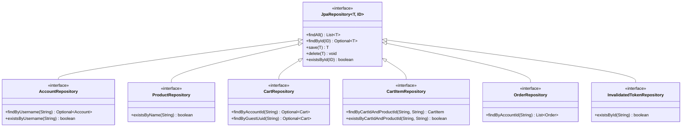

# Tài Liệu Diagrams Chi Tiết - Hệ Thống AIMS

## Mục Lục
1. [Unified Analysis Class Diagram](#1-unified-analysis-class-diagram)
2. [Use Case 1: Place Order](#use-case-1-place-order)
3. [Use Case 2: Add Product to Cart](#use-case-2-add-product-to-cart)
4. [Use Case 3: Pay Order (VietQR)](#use-case-3-pay-order-vietqr)
5. [Use Case 4: Pay Order by Credit Card](#use-case-4-pay-order-by-credit-card)
6. [Use Case 5: Select Delivery Method](#use-case-5-select-delivery-method)
7. [Use Case 6: View Product Details](#use-case-6-view-product-details)
8. [Use Case 7: Search Products](#use-case-7-search-products)
9. [Use Case 8: Create Product](#use-case-8-create-product)
10. [Use Case 9: Update Product](#use-case-9-update-product)
11. [Use Case 10: Delete Product](#use-case-10-delete-product)
12. [Use Case 11: Log In](#use-case-11-log-in)
13. [Use Case 12: Log Out](#use-case-12-log-out)

---

## 1. Unified Analysis Class Diagram

### 1.1 Complete System Class Diagram


### 1.2 Controller Layer Class Diagram


### 1.3 Service Layer Class Diagram


### 1.4 Repository Layer Class Diagram



---


## Use Case 1: Place Order

### 1.1 Sequence Diagram


### 1.2 Analysis Class Diagram


---

## Use Case 2: Add Product to Cart

### 2.1 Sequence Diagram


### 2.2 Analysis Class Diagram


---

## Use Case 3: Pay Order (VietQR)

### 3.1 Sequence Diagram


### 3.2 Analysis Class Diagram


---

## Use Case 4: Pay Order by Credit Card

### 4.1 Sequence Diagram


### 4.2 Analysis Class Diagram


---


## Use Case 5: Select Delivery Method

### 5.1 Sequence Diagram


### 5.2 Analysis Class Diagram


---

## Use Case 6: View Product Details

### 6.1 Sequence Diagram


### 6.2 Analysis Class Diagram


---

## Use Case 7: Search Products

### 7.1 Sequence Diagram


### 7.2 Analysis Class Diagram

```mermaid
classDiagram
    %% Boundary Classes
    class SearchBar {
        <<boundary>>
        +searchTerm: string
        +handleInputChange()
        +handleSearch()
        +clearSearch()
    }

    class ProductFilters {
        <<boundary>>
        +selectedCategory: string
        +priceRange: PriceRange
        +sortBy: string
        +sortDirection: string
        +