## Mục lục
1. [Use Case 1: Place Order](#use-case-1-place-order)
2. [Use Case 2: Add Product to Cart](#use-case-2-add-product-to-cart)
3. [Use Case 3: Pay Order (VietQR)](#use-case-3-pay-order-vietqr)
4. [Use Case 4: Pay Order by Credit Card](#use-case-4-pay-order-by-credit-card)
5. [Use Case 5: Select Delivery Method](#use-case-5-select-delivery-method)
6. [Use Case 6: View Product Details](#use-case-6-view-product-details)
7. [Use Case 7: Search Products](#use-case-7-search-products)
8. [Use Case 8: Create Product](#use-case-8-create-product)
9. [Use Case 9: Update Product](#use-case-9-update-product)
10. [Use Case 10: Delete Product](#use-case-10-delete-product)
11. [Use Case 11: Log In](#use-case-11-log-in)
12. [Use Case 12: Log Out](#use-case-12-log-out)

---

## Use Case 1: Place Order

### 1.1 Sequence Diagram

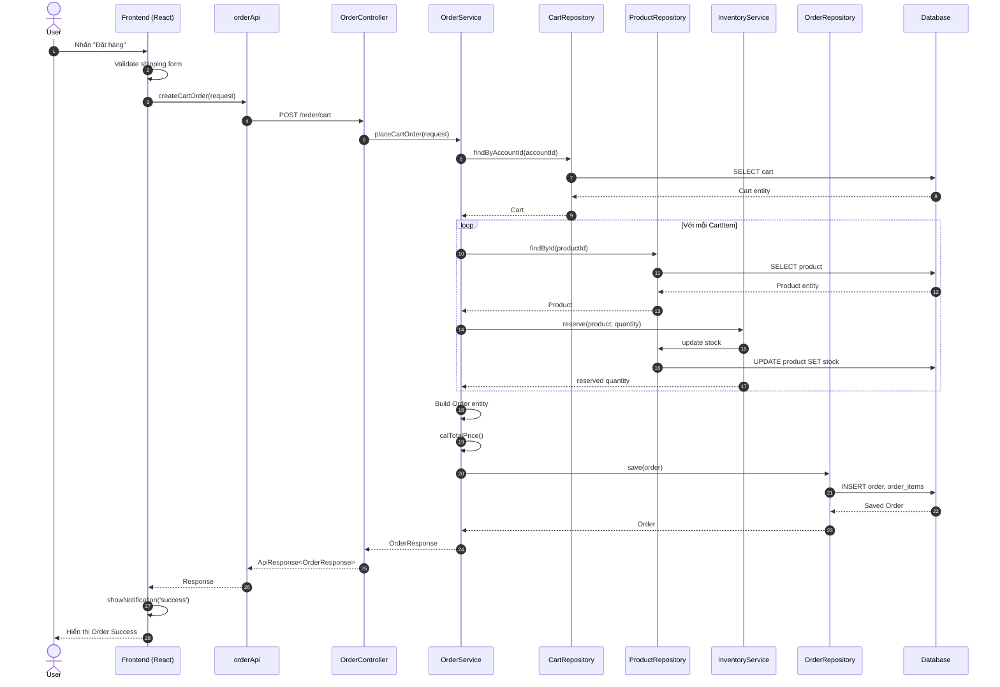

### 1.2 Detail Class Diagram

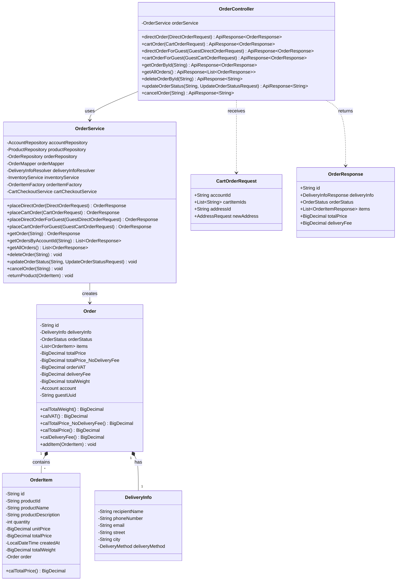

### 1.3 Analysis Class Diagram

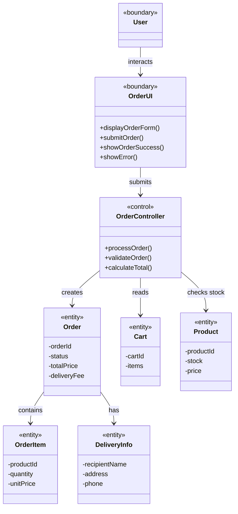

### 1.4 Activity Diagram

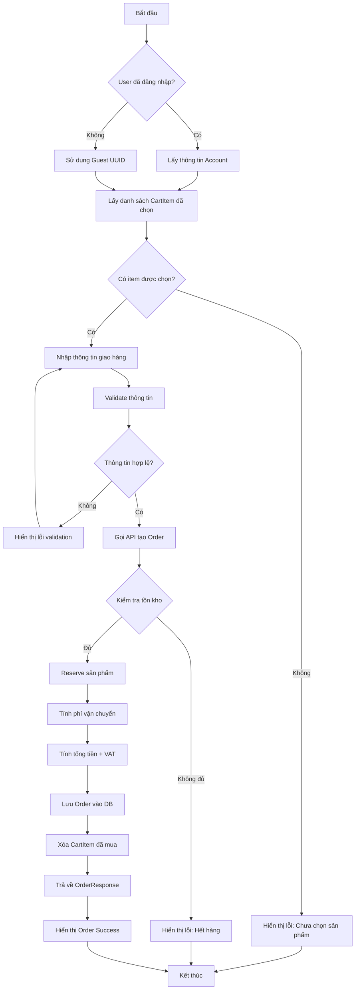

### 1.5 Communication Diagram

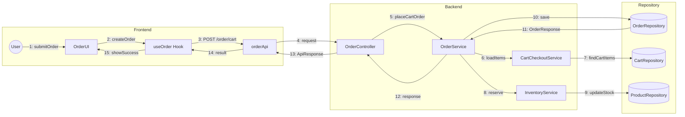

---

## Use Case 2: Add Product to Cart

### 2.1 Sequence Diagram

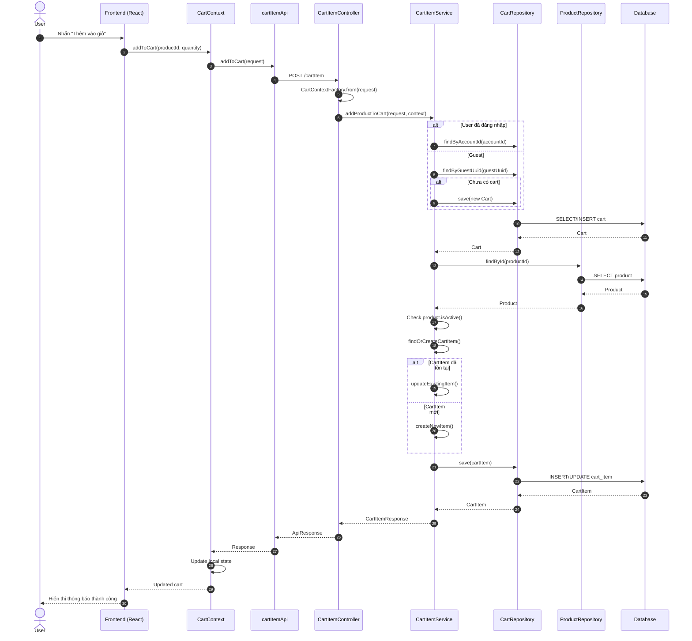

### 2.2 Detail Class Diagram

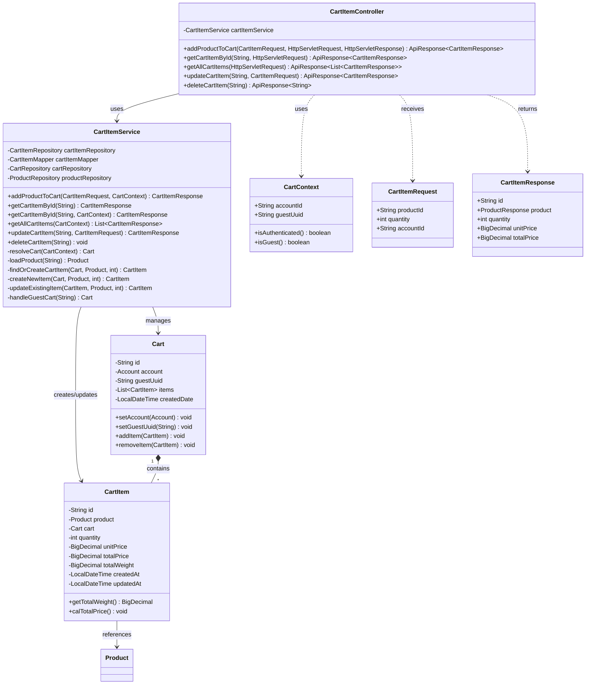

### 2.3 Analysis Class Diagram

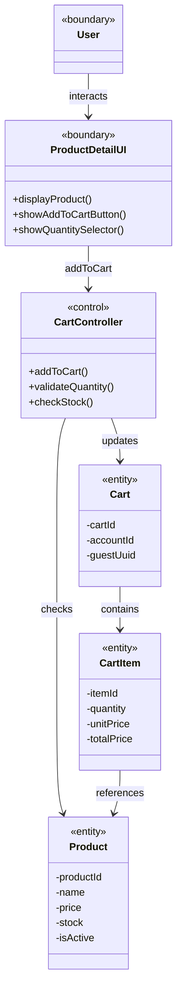

### 2.4 Activity Diagram

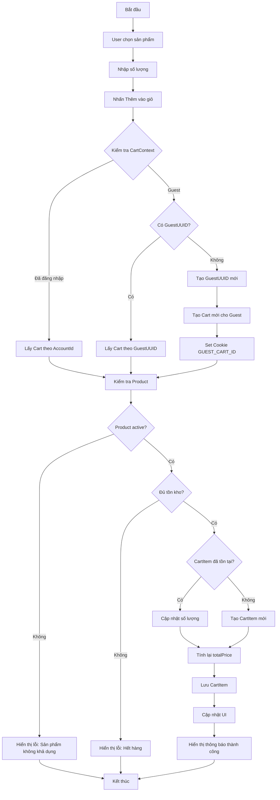

### 2.5 Communication Diagram

```mermaid
flowchart LR
    subgraph Frontend
        User((User))
        ProductUI[ProductDetailUI]
        CartCtx[CartContext]
        API[cartItemApi]
    end
    
    subgraph Backend
        Controller[CartItemController]
        Factory[CartContextFactory]
        Service[CartItemService]
    end
    
    subgraph Repository
        CartRepo[(CartRepository)]
        ProductRepo[(ProductRepository)]
        CartItemRepo[(CartItemRepository)]
    end

    User -->|1: addToCart| ProductUI
    ProductUI -->|2: addToCart| CartCtx
    CartCtx -->|3: POST /cartItem| API
    API -->|4: request| Controller
    Controller -->|5: from(request)| Factory
    Factory -->|6: CartContext| Controller
    Controller -->|7: addProductToCart| Service
    Service -->|8: resolveCart| CartRepo
    Service -->|9: loadProduct| ProductRepo
    Service -->|10: findOrCreate| CartItemRepo
    CartItemRepo -->|11: CartItem| Service
    Service -->|12: response| Controller
    Controller -->|13: ApiResponse| API
    API -->|14: result| CartCtx
    CartCtx -->|15: updateState| ProductUI
```

---

## Use Case 3: Pay Order (VietQR)

### 3.1 Sequence Diagram

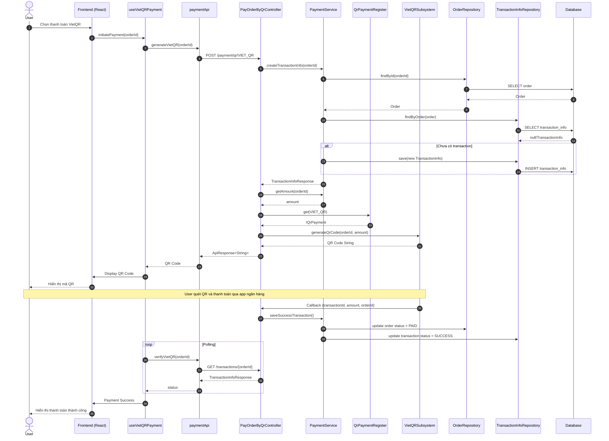

### 3.2 Detail Class Diagram

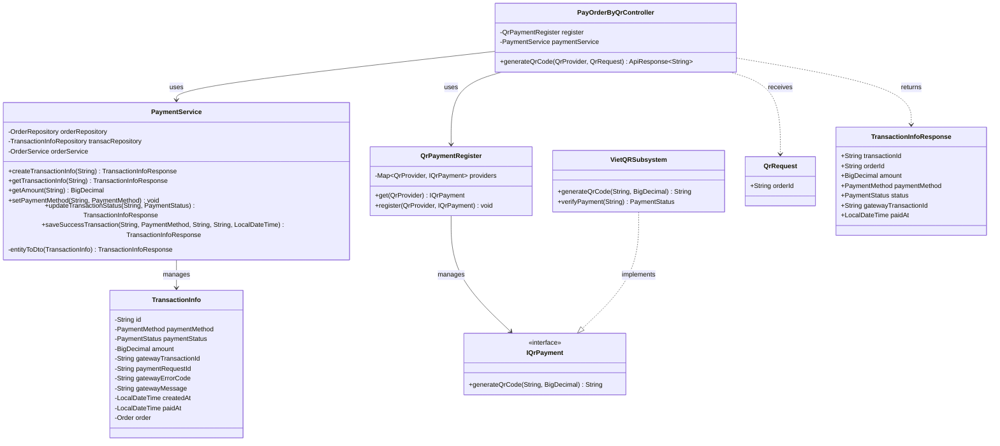

### 3.3 Analysis Class Diagram

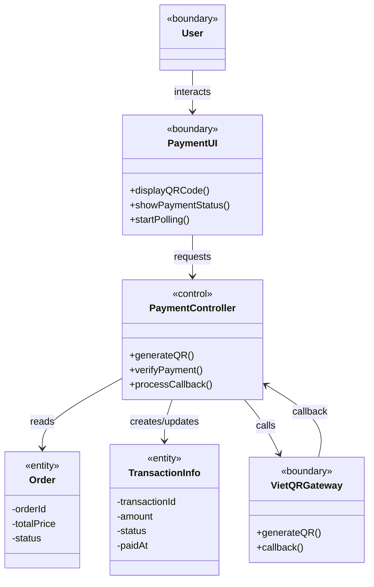

### 3.4 Activity Diagram

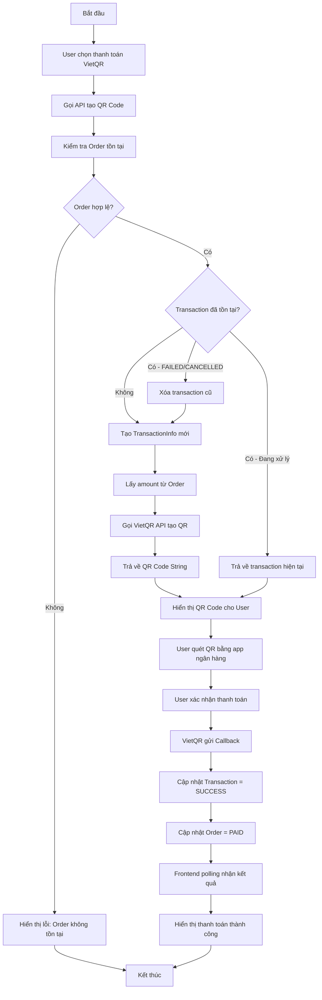

### 3.5 Communication Diagram

```mermaid
flowchart LR
    subgraph Frontend
        User((User))
        PaymentUI[VietQRPayment]
        Hook[useVietQRPayment]
        API[paymentApi]
    end
    
    subgraph Backend
        Controller[PayOrderByQrController]
        PaymentSvc[PaymentService]
        QrRegister[QrPaymentRegister]
        Callback[CallbackController]
    end
    
    subgraph External
        VietQR[VietQR Gateway]
        Bank[Banking App]
    end
    
    subgraph Repository
        OrderRepo[(OrderRepository)]
        TransRepo[(TransactionInfoRepository)]
    end

    User -->|1: selectVietQR| PaymentUI
    PaymentUI -->|2: initiatePayment| Hook
    Hook -->|3: generateVietQR| API
    API -->|4: POST /payment/qr| Controller
    Controller -->|5: createTransaction| PaymentSvc
    PaymentSvc -->|6: findOrder| OrderRepo
    PaymentSvc -->|7: saveTransaction| TransRepo
    Controller -->|8: get(VIET_QR)| QrRegister
    QrRegister -->|9: generateQR| VietQR
    VietQR -->|10: QR Code| Controller
    Controller -->|11: response| API
    API -->|12: displayQR| Hook
    Hook -->|13: showQR| PaymentUI
    User -->|14: scan QR| Bank
    Bank -->|15: payment| VietQR
    VietQR -->|16: callback| Callback
    Callback -->|17: saveSuccess| PaymentSvc
    Hook -->|18: polling| API
    API -->|19: verify| Controller
    Controller -->|20: SUCCESS| API
    API -->|21: result| Hook
    Hook -->|22: showSuccess| PaymentUI
```

---

## Use Case 4: Pay Order by Credit Card

### 4.1 Sequence Diagram

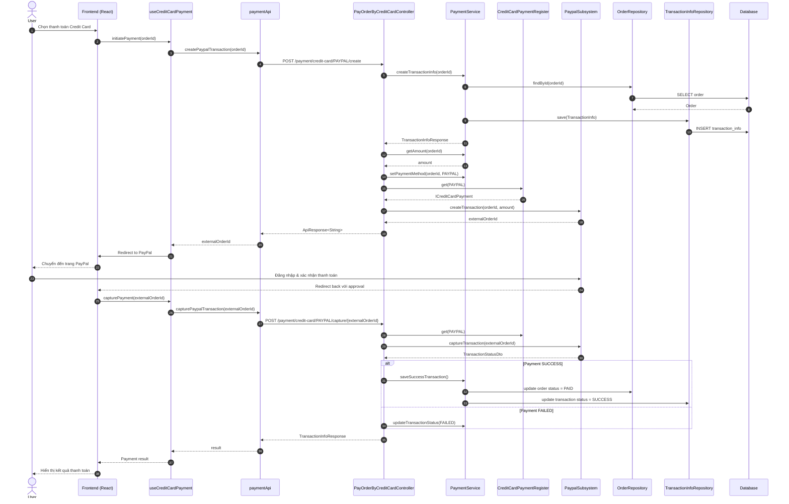

### 4.2 Detail Class Diagram

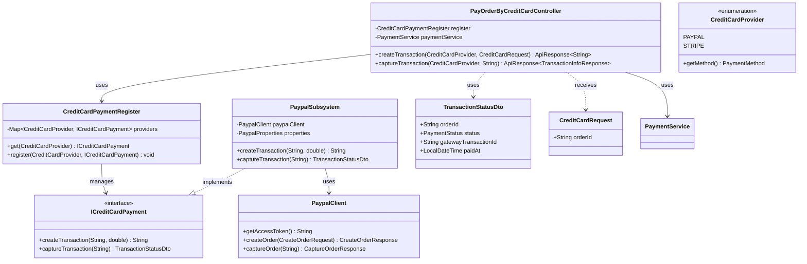

### 4.3 Analysis Class Diagram

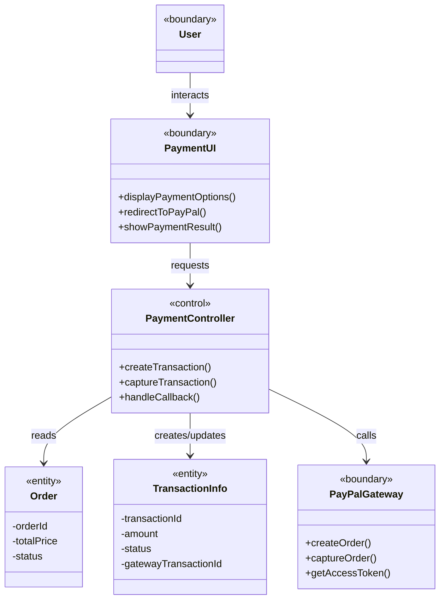

### 4.4 Activity Diagram

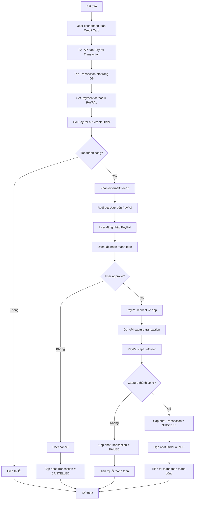

### 4.5 Communication Diagram

```mermaid
flowchart LR
    subgraph Frontend
        User((User))
        PaymentUI[CreditCardPayment]
        Hook[useCreditCardPayment]
        API[paymentApi]
    end
    
    subgraph Backend
        Controller[PayOrderByCreditCardController]
        PaymentSvc[PaymentService]
        CCRegister[CreditCardPaymentRegister]
        PaypalSvc[PaypalSubsystem]
    end
    
    subgraph External
        PayPal[PayPal API]
    end
    
    subgraph Repository
        OrderRepo[(OrderRepository)]
        TransRepo[(TransactionInfoRepository)]
    end

    User -->|1: selectCreditCard| PaymentUI
    PaymentUI -->|2: initiatePayment| Hook
    Hook -->|3: createPaypalTransaction| API
    API -->|4: POST /create| Controller
    Controller -->|5: createTransaction| PaymentSvc
    PaymentSvc -->|6: saveTransaction| TransRepo
    Controller -->|7: get(PAYPAL)| CCRegister
    CCRegister -->|8: createTransaction| PaypalSvc
    PaypalSvc -->|9: createOrder| PayPal
    PayPal -->|10: externalOrderId| PaypalSvc
    PaypalSvc -->|11: orderId| Controller
    Controller -->|12: response| API
    API -->|13: redirect| Hook
    Hook -->|14: openPayPal| PaymentUI
    User -->|15: approve| PayPal
    PayPal -->|16: redirect| PaymentUI
    PaymentUI -->|17: capture| Hook
    Hook -->|18: capturePaypal| API
    API -->|19: POST /capture| Controller
    Controller -->|20: captureTransaction| PaypalSvc
    PaypalSvc -->|21: captureOrder| PayPal
    PayPal -->|22: result| PaypalSvc
    Controller -->|23: saveSuccess| PaymentSvc
    PaymentSvc -->|24: updateOrder| OrderRepo
    Controller -->|25: response| API
    API -->|26: result| Hook
    Hook -->|27: showSuccess| PaymentUI
```

---

## Use Case 5: Select Delivery Method

### 5.1 Sequence Diagram

```mermaid
sequenceDiagram
    autonumber
    actor User
    participant FE as Frontend (React)
    participant CheckoutCtx as CheckoutContext
    participant ShippingForm as ShippingForm Component
    participant DeliveryAPI as deliveryApi
    participant BE as Backend

    User->>FE: Vào trang Checkout
    FE->>CheckoutCtx: getShippingData()
    CheckoutCtx-->>FE: Current shipping data
    FE->>ShippingForm: Render form
    ShippingForm-->>User: Hiển thị form giao hàng
    
    User->>ShippingForm: Nhập thông tin địa chỉ
    ShippingForm->>ShippingForm: Validate fields
    
    User->>ShippingForm: Chọn Delivery Method
    Note over User,ShippingForm: STANDARD hoặc RUSH
    
    ShippingForm->>CheckoutCtx: updateShippingData(data)
    CheckoutCtx->>CheckoutCtx: Calculate delivery fee
    
    alt STANDARD Delivery
        CheckoutCtx->>CheckoutCtx: Base fee = 22,000 (HN/HCM) hoặc 30,000
        CheckoutCtx->>CheckoutCtx: Giảm 25,000 nếu đơn >= 100,000
        CheckoutCtx->>CheckoutCtx: Thêm phí theo cân nặng
    else RUSH Delivery
        CheckoutCtx->>CheckoutCtx: Base fee + Rush surcharge
    end
    
    CheckoutCtx-->>ShippingForm: Updated delivery fee
    ShippingForm-->>User: Hiển thị phí vận chuyển
    
    User->>ShippingForm: Xác nhận thông tin
    ShippingForm->>CheckoutCtx: saveShippingData()
    CheckoutCtx-->>FE: Navigate to payment
```

### 5.2 Detail Class Diagram

```mermaid
classDiagram
    class ShippingForm {
        -formData: ShippingFormData
        -errors: ValidationErrors
        +handleInputChange(field, value) void
        +handleDeliveryMethodChange(method) void
        +validateForm() boolean
        +submitForm() void
    }

    class CheckoutContext {
        -shippingData: ShippingFormData
        -deliveryFee: number
        -totalWeight: number
        +updateShippingData(data) void
        +calculateDeliveryFee() number
        +getShippingData() ShippingFormData
    }

    class ShippingFormData {
        +String fullName
        +String phoneNumber
        +String email
        +String address
        +String province
        +DeliveryMethod deliveryMethod
        +String note
    }

    class DeliveryMethod {
        <<enumeration>>
        STANDARD
        RUSH
    }

    class DeliveryInfo {
        -String recipientName
        -String phoneNumber
        -String email
        -String street
        -String city
        -DeliveryMethod deliveryMethod
    }

    class Order {
        -DeliveryInfo deliveryInfo
        -BigDecimal deliveryFee
        -BigDecimal totalWeight
        +calDeliveryFee() BigDecimal
    }

    ShippingForm --> CheckoutContext : uses
    ShippingForm --> ShippingFormData : manages
    ShippingFormData --> DeliveryMethod : has
    Order --> DeliveryInfo : contains
    DeliveryInfo --> DeliveryMethod : has
```

### 5.3 Analysis Class Diagram

```mermaid
classDiagram
    class User {
        <<boundary>>
    }
    
    class ShippingFormUI {
        <<boundary>>
        +displayForm()
        +showDeliveryOptions()
        +displayDeliveryFee()
        +validateInput()
    }
    
    class DeliveryController {
        <<control>>
        +selectDeliveryMethod()
        +calculateFee()
        +validateAddress()
    }
    
    class ShippingInfo {
        <<entity>>
        -recipientName
        -address
        -phone
        -deliveryMethod
    }
    
    class DeliveryFeeCalculator {
        <<control>>
        +calculateBaseFee()
        +applyDiscount()
        +addWeightSurcharge()
    }

    User --> ShippingFormUI : interacts
    ShippingFormUI --> DeliveryController : submits
    DeliveryController --> ShippingInfo : creates
    DeliveryController --> DeliveryFeeCalculator : uses
```

### 5.4 Activity Diagram

```mermaid
flowchart TD
    A[Bắt đầu] --> B[User vào trang Checkout]
    B --> C[Hiển thị form giao hàng]
    C --> D[User nhập thông tin người nhận]
    D --> E[User nhập địa chỉ]
    E --> F[User chọn tỉnh/thành phố]
    F --> G[User chọn phương thức giao hàng]
    G --> H{Phương thức?}
    H -->|STANDARD| I[Tính phí cơ bản]
    H -->|RUSH| J[Tính phí cơ bản + phụ phí]
    I --> K{Thành phố?}
    J --> K
    K -->|HN/HCM| L[Base = 22,000 VND]
    K -->|Khác| M[Base = 30,000 VND]
    L --> N{Tổng đơn >= 100,000?}
    M --> N
    N -->|Có| O[Giảm 25,000 VND]
    N -->|Không| P[Giữ nguyên]
    O --> Q{Cân nặng > 3kg?}
    P --> Q
    Q -->|Có| R[Thêm 2,500/0.5kg]
    Q -->|Không| S[Không thêm phí]
    R --> T[Hiển thị tổng phí vận chuyển]
    S --> T
    T --> U[User xác nhận thông tin]
    U --> V{Thông tin hợp lệ?}
    V -->|Không| W[Hiển thị lỗi validation]
    W --> D
    V -->|Có| X[Lưu thông tin giao hàng]
    X --> Y[Chuyển đến bước thanh toán]
    Y --> Z[Kết thúc]
```

### 5.5 Communication Diagram

```mermaid
flowchart LR
    subgraph Frontend
        User((User))
        CheckoutPage[CheckoutPage]
        ShippingForm[ShippingForm]
        CheckoutCtx[CheckoutContext]
    end
    
    subgraph Components
        ProvinceSelect[ProvinceSelector]
        DeliverySelect[DeliveryMethodSelector]
        FeeDisplay[DeliveryFeeDisplay]
    end

    User -->|1: enterCheckout| CheckoutPage
    CheckoutPage -->|2: render| ShippingForm
    ShippingForm -->|3: getShippingData| CheckoutCtx
    CheckoutCtx -->|4: currentData| ShippingForm
    User -->|5: inputAddress| ShippingForm
    ShippingForm -->|6: selectProvince| ProvinceSelect
    ProvinceSelect -->|7: province| ShippingForm
    User -->|8: selectDelivery| DeliverySelect
    DeliverySelect -->|9: method| ShippingForm
    ShippingForm -->|10: updateShipping| CheckoutCtx
    CheckoutCtx -->|11: calculateFee| CheckoutCtx
    CheckoutCtx -->|12: deliveryFee| FeeDisplay
    FeeDisplay -->|13: displayFee| ShippingForm
    User -->|14: confirm| ShippingForm
    ShippingForm -->|15: saveData| CheckoutCtx
    CheckoutCtx -->|16: navigate| CheckoutPage
```

---

## Use Case 6: View Product Details

### 6.1 Sequence Diagram

```mermaid
sequenceDiagram
    autonumber
    actor User
    participant FE as Frontend (React)
    participant Router as React Router
    participant ProductPage as ProductDetailsPage
    participant ProductHook as useProductDetails
    participant ProductAPI as productApi
    participant BE as ProductController
    participant ProductSvc as ProductService
    participant ProductRepo as ProductRepository
    participant DB as Database

    User->>FE: Click vào sản phẩm
    FE->>Router: Navigate to /product/{id}
    Router->>ProductPage: Render with productId
    ProductPage->>ProductHook: useProductDetails(productId)
    ProductHook->>ProductAPI: getProductById(id)
    ProductAPI->>BE: GET /product/{id}
    BE->>ProductSvc: getProductById(id)
    ProductSvc->>ProductRepo: findById(id)
    ProductRepo->>DB: SELECT * FROM product WHERE id = ?
    DB-->>ProductRepo: Product entity
    ProductRepo-->>ProductSvc: Product
    ProductSvc->>ProductSvc: productResponseDispatcher.toProductResponse()
    ProductSvc-->>BE: BaseProductResponse
    BE-->>ProductAPI: ApiResponse<BaseProductResponse>
    ProductAPI-->>ProductHook: Product data
    ProductHook-->>ProductPage: { product, loading, error }
    
    alt Product type = BOOK
        ProductPage->>ProductPage: Render BookDetails
    else Product type = CD
        ProductPage->>ProductPage: Render CDDetails
    else Product type = DVD
        ProductPage->>ProductPage: Render DVDDetails
    else Product type = NEWSPAPER
        ProductPage->>ProductPage: Render NewspaperDetails
    end
    
    ProductPage-->>User: Hiển thị chi tiết sản phẩm
```

### 6.2 Detail Class Diagram

```mermaid
classDiagram
    class ProductController {
        -ProductService productService
        +createProduct(BaseProductRequest) ApiResponse~BaseProductResponse~
        +getProduct(String) ApiResponse~BaseProductResponse~
        +getProducts() ApiResponse~List~BaseProductResponse~~
        +updateProduct(String, BaseProductRequest) ApiResponse~BaseProductResponse~
        +deleteProduct(String) ApiResponse~String~
    }

    class ProductService {
        -ProductRepository productRepository
        -ProductResponseDispatcher productResponseDispatcher
        -ProductUpdateDispatcher productUpdateDispatcher
        -ProductCreateDispatcher productCreateDispatcher
        +createProduct(BaseProductRequest) BaseProductResponse
        +getProductById(String) BaseProductResponse
        +getAllProducts() List~BaseProductResponse~
        +updateProduct(String, BaseProductRequest) BaseProductResponse
        +deleteProduct(String) void
    }

    class Product {
        <<abstract>>
        -String id
        -String name
        -String description
        -ProductType type
        -int stock
        -BigDecimal weight
        -BigDecimal price
        -LocalDateTime createdDate
        -LocalDateTime lastModifiedDate
        -String imageUrl
        -boolean active
        +calWeightWithQuantity(int) BigDecimal
    }

    class Book {
        -String author
        -String publisher
        -String isbn
        -int pages
        -String language
        -String genre
    }

    class CD {
        -String artist
        -String recordLabel
        -String genre
        -int trackCount
        -LocalDate releaseDate
    }

    class DVD {
        -String director
        -String studio
        -int runtime
        -String language
        -String subtitles
        -LocalDate releaseDate
    }

    class Newspaper {
        -String publisher
        -LocalDate publicationDate
        -String edition
    }

    class ProductType {
        <<enumeration>>
        BOOK
        CD
        DVD
        NEWSPAPER
    }

    Product <|-- Book
    Product <|-- CD
    Product <|-- DVD
    Product <|-- Newspaper
    Product --> ProductType : has
    ProductController --> ProductService : uses
    ProductService --> Product : manages
```

### 6.3 Analysis Class Diagram

```mermaid
classDiagram
    class User {
        <<boundary>>
    }
    
    class ProductListUI {
        <<boundary>>
        +displayProducts()
        +handleProductClick()
    }
    
    class ProductDetailUI {
        <<boundary>>
        +displayProductInfo()
        +displayTypeSpecificInfo()
        +showAddToCartButton()
    }
    
    class ProductController {
        <<control>>
        +getProductDetails()
        +determineProductType()
    }
    
    class Product {
        <<entity>>
        -productId
        -name
        -price
        -stock
        -type
    }
    
    class Book {
        <<entity>>
        -author
        -isbn
        -pages
    }
    
    class CD {
        <<entity>>
        -artist
        -trackCount
    }

    User --> ProductListUI : browses
    ProductListUI --> ProductController : selectProduct
    ProductController --> Product : retrieves
    ProductController --> ProductDetailUI : displays
    Product <|-- Book
    Product <|-- CD
```

### 6.4 Activity Diagram

```mermaid
flowchart TD
    A[Bắt đầu] --> B[User click vào sản phẩm]
    B --> C[Navigate đến /product/id]
    C --> D[Gọi API lấy chi tiết sản phẩm]
    D --> E{Sản phẩm tồn tại?}
    E -->|Không| F[Hiển thị trang 404]
    F --> Z[Kết thúc]
    E -->|Có| G[Nhận dữ liệu sản phẩm]
    G --> H{Kiểm tra loại sản phẩm}
    H -->|BOOK| I[Render BookDetails]
    H -->|CD| J[Render CDDetails]
    H -->|DVD| K[Render DVDDetails]
    H -->|NEWSPAPER| L[Render NewspaperDetails]
    I --> M[Hiển thị: Author, ISBN, Pages, Publisher]
    J --> N[Hiển thị: Artist, Record Label, Tracks]
    K --> O[Hiển thị: Director, Runtime, Studio]
    L --> P[Hiển thị: Publisher, Publication Date, Edition]
    M --> Q[Hiển thị thông tin chung]
    N --> Q
    O --> Q
    P --> Q
    Q --> R[Hiển thị: Name, Price, Stock, Description]
    R --> S[Hiển thị nút Thêm vào giỏ]
    S --> T{Còn hàng?}
    T -->|Có| U[Enable nút Add to Cart]
    T -->|Không| V[Disable nút, hiển thị Hết hàng]
    U --> Z
    V --> Z
```

### 6.5 Communication Diagram

```mermaid
flowchart LR
    subgraph Frontend
        User((User))
        ProductList[ProductGrid]
        Router[React Router]
        ProductPage[ProductDetailsPage]
        Hook[useProductDetails]
        API[productApi]
    end
    
    subgraph Backend
        Controller[ProductController]
        Service[ProductService]
        Dispatcher[ProductResponseDispatcher]
    end
    
    subgraph Repository
        ProductRepo[(ProductRepository)]
    end
    
    subgraph DetailComponents
        BookDetail[BookDetails]
        CDDetail[CDDetails]
        DVDDetail[DVDDetails]
    end

    User -->|1: clickProduct| ProductList
    ProductList -->|2: navigate| Router
    Router -->|3: render| ProductPage
    ProductPage -->|4: useProductDetails| Hook
    Hook -->|5: getProductById| API
    API -->|6: GET /product/id| Controller
    Controller -->|7: getProductById| Service
    Service -->|8: findById| ProductRepo
    ProductRepo -->|9: Product| Service
    Service -->|10: toResponse| Dispatcher
    Dispatcher -->|11: response| Service
    Service -->|12: BaseProductResponse| Controller
    Controller -->|13: ApiResponse| API
    API -->|14: data| Hook
    Hook -->|15: product| ProductPage
    ProductPage -->|16: renderByType| BookDetail
    ProductPage -->|16: renderByType| CDDetail
    ProductPage -->|16: renderByType| DVDDetail
```

---

## Use Case 7: Search Products

### 7.1 Sequence Diagram

```mermaid
sequenceDiagram
    autonumber
    actor User
    participant FE as Frontend (React)
    participant HomePage as HomePage
    participant ProductHook as useHomePage
    participant ProductAPI as productApi
    participant BE as ProductController
    participant ProductSvc as ProductService
    participant ProductRepo as ProductRepository
    participant DB as Database

    User->>FE: Nhập từ khóa tìm kiếm
    FE->>HomePage: handleSearch(keyword)
    HomePage->>ProductHook: searchProducts(keyword)
    
    Note over ProductHook,ProductAPI: Hiện tại FE filter local
    
    ProductHook->>ProductAPI: getAllProducts()
    ProductAPI->>BE: GET /product
    BE->>ProductSvc: getAllProducts()
    ProductSvc->>ProductRepo: findAll()
    ProductRepo->>DB: SELECT * FROM product
    DB-->>ProductRepo: List<Product>
    ProductRepo-->>ProductSvc: List<Product>
    ProductSvc->>ProductSvc: map to BaseProductResponse
    ProductSvc-->>BE: List<BaseProductResponse>
    BE-->>ProductAPI: ApiResponse<List>
    ProductAPI-->>ProductHook: All products
    
    ProductHook->>ProductHook: Filter by keyword
    ProductHook->>ProductHook: Filter by category
    ProductHook->>ProductHook: Filter by price range
    ProductHook->>ProductHook: Sort products
    ProductHook-->>HomePage: Filtered products
    HomePage-->>User: Hiển thị kết quả tìm kiếm
```

### 7.2 Detail Class Diagram

```mermaid
classDiagram
    class HomePage {
        -products: Product[]
        -filteredProducts: Product[]
        -searchKeyword: string
        -selectedCategory: string
        -priceRange: PriceRange
        +handleSearch(keyword) void
        +handleCategoryFilter(category) void
        +handlePriceFilter(range) void
        +handleSort(sortBy) void
    }

    class useHomePage {
        -products: Product[]
        -loading: boolean
        -error: string
        +fetchProducts() void
        +filterProducts(filters) Product[]
        +searchProducts(keyword) Product[]
    }

    class ProductFilters {
        -selectedCategory: string
        -priceRange: PriceRange
        -sortBy: string
        +onCategoryChange(category) void
        +onPriceChange(range) void
        +onSortChange(sort) void
    }

    class ProductGrid {
        -products: Product[]
        -loading: boolean
        +renderProducts() void
        +handleProductClick(id) void
    }

    class ProductCard {
        -product: Product
        +displayProduct() void
        +handleAddToCart() void
    }

    class PriceRange {
        +number min
        +number max
    }

    HomePage --> useHomePage : uses
    HomePage --> ProductFilters : contains
    HomePage --> ProductGrid : contains
    ProductGrid --> ProductCard : renders
    ProductFilters --> PriceRange : uses
```

### 7.3 Analysis Class Diagram

```mermaid
classDiagram
    class User {
        <<boundary>>
    }
    
    class SearchUI {
        <<boundary>>
        +displaySearchBar()
        +displayFilters()
        +displayResults()
    }
    
    class SearchController {
        <<control>>
        +search()
        +filterByCategory()
        +filterByPrice()
        +sortResults()
    }
    
    class Product {
        <<entity>>
        -productId
        -name
        -price
        -category
        -description
    }
    
    class SearchCriteria {
        <<entity>>
        -keyword
        -category
        -minPrice
        -maxPrice
        -sortBy
    }

    User --> SearchUI : interacts
    SearchUI --> SearchController : submits
    SearchController --> Product : searches
    SearchController --> SearchCriteria : uses
```

### 7.4 Activity Diagram

```mermaid
flowchart TD
    A[Bắt đầu] --> B[User vào trang Home]
    B --> C[Load tất cả sản phẩm]
    C --> D[Hiển thị danh sách sản phẩm]
    D --> E{User thực hiện action?}
    E -->|Tìm kiếm| F[Nhập từ khóa]
    E -->|Lọc danh mục| G[Chọn category]
    E -->|Lọc giá| H[Chọn khoảng giá]
    E -->|Sắp xếp| I[Chọn tiêu chí sort]
    E -->|Không| J[Giữ nguyên]
    F --> K[Filter theo keyword]
    G --> L[Filter theo category]
    H --> M[Filter theo price range]
    I --> N[Sort products]
    K --> O[Kết hợp các filter]
    L --> O
    M --> O
    N --> O
    J --> O
    O --> P[Cập nhật danh sách hiển thị]
    P --> Q{Có kết quả?}
    Q -->|Có| R[Hiển thị sản phẩm]
    Q -->|Không| S[Hiển thị: Không tìm thấy]
    R --> E
    S --> E
```

### 7.5 Communication Diagram

```mermaid
flowchart LR
    subgraph Frontend
        User((User))
        SearchBar[SearchBar]
        Filters[ProductFilters]
        HomePage[HomePage]
        Hook[useHomePage]
        Grid[ProductGrid]
        API[productApi]
    end
    
    subgraph Backend
        Controller[ProductController]
        Service[ProductService]
    end
    
    subgraph Repository
        ProductRepo[(ProductRepository)]
    end

    User -->|1: enterKeyword| SearchBar
    SearchBar -->|2: onSearch| HomePage
    User -->|3: selectFilter| Filters
    Filters -->|4: onFilterChange| HomePage
    HomePage -->|5: fetchProducts| Hook
    Hook -->|6: getAllProducts| API
    API -->|7: GET /product| Controller
    Controller -->|8: getAllProducts| Service
    Service -->|9: findAll| ProductRepo
    ProductRepo -->|10: products| Service
    Service -->|11: response| Controller
    Controller -->|12: ApiResponse| API
    API -->|13: data| Hook
    Hook -->|14: filterLocal| Hook
    Hook -->|15: filteredProducts| HomePage
    HomePage -->|16: render| Grid
```

---

## Use Case 8: Create Product

### 8.1 Sequence Diagram

```mermaid
sequenceDiagram
    autonumber
    actor ProductManager
    participant FE as Frontend (React)
    participant ProductForm as ProductForm
    participant ProductHook as useProductCUD
    participant ProductAPI as productApi
    participant BE as ProductController
    participant ProductSvc as ProductService
    participant CreateDispatcher as ProductCreateDispatcher
    participant ProductRepo as ProductRepository
    participant DB as Database

    ProductManager->>FE: Nhấn "Thêm sản phẩm"
    FE->>ProductForm: Open create form
    ProductForm-->>ProductManager: Hiển thị form trống
    
    ProductManager->>ProductForm: Nhập thông tin sản phẩm
    ProductManager->>ProductForm: Chọn loại sản phẩm (BOOK/CD/DVD/NEWSPAPER)
    ProductManager->>ProductForm: Upload hình ảnh
    ProductManager->>ProductForm: Nhấn "Lưu"
    
    ProductForm->>ProductForm: Validate form data
    ProductForm->>ProductHook: createProduct(data)
    ProductHook->>ProductAPI: createProduct(data)
    ProductAPI->>BE: POST /product
    
    Note over BE: @PreAuthorize("hasRole('PRODUCT_MANAGER')")
    
    BE->>ProductSvc: createProduct(request)
    ProductSvc->>ProductRepo: existsByName(name)
    ProductRepo->>DB: SELECT COUNT(*) WHERE name = ?
    DB-->>ProductRepo: count
    
    alt Sản phẩm đã tồn tại
        ProductRepo-->>ProductSvc: true
        ProductSvc-->>BE: throw PRODUCT_EXISTED
        BE-->>ProductAPI: Error Response
        ProductAPI-->>ProductHook: Error
        ProductHook-->>ProductForm: Show error
    else Sản phẩm chưa tồn tại
        ProductRepo-->>ProductSvc: false
        ProductSvc->>CreateDispatcher: create(request)
        CreateDispatcher->>CreateDispatcher: Determine product type
        CreateDispatcher->>CreateDispatcher: Create specific product (Book/CD/DVD/Newspaper)
        CreateDispatcher-->>ProductSvc: Product entity
        ProductSvc->>ProductRepo: save(product)
        ProductRepo->>DB: INSERT INTO product, book/cd/dvd/newspaper
        DB-->>ProductRepo: Saved Product
        ProductRepo-->>ProductSvc: Product
        ProductSvc-->>BE: BaseProductResponse
        BE-->>ProductAPI: ApiResponse<BaseProductResponse>
        ProductAPI-->>ProductHook: Success
        ProductHook-->>ProductForm: Close form, refresh list
        ProductForm-->>ProductManager: Hiển thị thông báo thành công
    end
```

### 8.2 Detail Class Diagram

```mermaid
classDiagram
    class ProductController {
        -ProductService productService
        +createProduct(BaseProductRequest) ApiResponse~BaseProductResponse~
    }

    class ProductService {
        -ProductRepository productRepository
        -ProductCreateDispatcher productCreateDispatcher
        -ProductResponseDispatcher productResponseDispatcher
        +createProduct(BaseProductRequest) BaseProductResponse
    }

    class ProductCreateDispatcher {
        -Map~ProductType, ProductCreatorMapper~ mappers
        +create(BaseProductRequest) Product
    }

    class ProductCreatorMapper {
        <<interface>>
        +toProduct(BaseProductRequest) Product
    }

    class BookCreatorMapper {
        +toProduct(BaseProductRequest) Book
    }

    class CDCreatorMapper {
        +toProduct(BaseProductRequest) CD
    }

    class DVDCreatorMapper {
        +toProduct(BaseProductRequest) DVD
    }

    class NewspaperCreatorMapper {
        +toProduct(BaseProductRequest) Newspaper
    }

    class BaseProductRequest {
        +String name
        +String description
        +ProductType type
        +int stock
        +BigDecimal weight
        +BigDecimal price
        +String imageUrl
        +String author
        +String publisher
        +String isbn
        +String artist
        +String director
    }

    ProductController --> ProductService : uses
    ProductService --> ProductCreateDispatcher : uses
    ProductCreateDispatcher --> ProductCreatorMapper : dispatches
    BookCreatorMapper ..|> ProductCreatorMapper
    CDCreatorMapper ..|> ProductCreatorMapper
    DVDCreatorMapper ..|> ProductCreatorMapper
    NewspaperCreatorMapper ..|> ProductCreatorMapper
    ProductController ..> BaseProductRequest : receives
```

### 8.3 Analysis Class Diagram

```mermaid
classDiagram
    class ProductManager {
        <<boundary>>
    }
    
    class ProductFormUI {
        <<boundary>>
        +displayForm()
        +validateInput()
        +uploadImage()
        +submitForm()
    }
    
    class ProductController {
        <<control>>
        +createProduct()
        +validateProduct()
        +checkDuplicate()
    }
    
    class Product {
        <<entity>>
        -productId
        -name
        -price
        -stock
        -type
    }
    
    class ProductFactory {
        <<control>>
        +createBook()
        +createCD()
        +createDVD()
        +createNewspaper()
    }

    ProductManager --> ProductFormUI : interacts
    ProductFormUI --> ProductController : submits
    ProductController --> ProductFactory : uses
    ProductFactory --> Product : creates
```

### 8.4 Activity Diagram

```mermaid
flowchart TD
    A[Bắt đầu] --> B[Product Manager mở form tạo sản phẩm]
    B --> C[Nhập thông tin cơ bản]
    C --> D[Chọn loại sản phẩm]
    D --> E{Loại sản phẩm?}
    E -->|BOOK| F[Nhập: Author, ISBN, Pages, Publisher]
    E -->|CD| G[Nhập: Artist, Record Label, Tracks]
    E -->|DVD| H[Nhập: Director, Runtime, Studio]
    E -->|NEWSPAPER| I[Nhập: Publisher, Publication Date]
    F --> J[Upload hình ảnh]
    G --> J
    H --> J
    I --> J
    J --> K[Nhấn Lưu]
    K --> L{Validate form?}
    L -->|Không hợp lệ| M[Hiển thị lỗi validation]
    M --> C
    L -->|Hợp lệ| N[Gọi API tạo sản phẩm]
    N --> O{Kiểm tra quyền?}
    O -->|Không có quyền| P[Hiển thị lỗi: Unauthorized]
    P --> Z[Kết thúc]
    O -->|Có quyền| Q{Sản phẩm đã tồn tại?}
    Q -->|Có| R[Hiển thị lỗi: Sản phẩm đã tồn tại]
    R --> C
    Q -->|Không| S[Tạo Product entity theo type]
    S --> T[Lưu vào Database]
    T --> U[Trả về ProductResponse]
    U --> V[Đóng form, refresh danh sách]
    V --> W[Hiển thị thông báo thành công]
    W --> Z
```

### 8.5 Communication Diagram

```mermaid
flowchart LR
    subgraph Frontend
        PM((Product Manager))
        ProductPage[ProductManagerPage]
        Form[ProductForm]
        Hook[useProductCUD]
        API[productApi]
    end
    
    subgraph Backend
        Controller[ProductController]
        Service[ProductService]
        Dispatcher[ProductCreateDispatcher]
        Mapper[ProductCreatorMapper]
    end
    
    subgraph Repository
        ProductRepo[(ProductRepository)]
    end

    PM -->|1: openForm| ProductPage
    ProductPage -->|2: render| Form
    PM -->|3: fillForm| Form
    PM -->|4: submit| Form
    Form -->|5: validate| Form
    Form -->|6: createProduct| Hook
    Hook -->|7: POST /product| API
    API -->|8: request| Controller
    Controller -->|9: createProduct| Service
    Service -->|10: existsByName| ProductRepo
    ProductRepo -->|11: false| Service
    Service -->|12: create| Dispatcher
    Dispatcher -->|13: toProduct| Mapper
    Mapper -->|14: Product| Dispatcher
    Dispatcher -->|15: Product| Service
    Service -->|16: save| ProductRepo
    ProductRepo -->|17: saved| Service
    Service -->|18: response| Controller
    Controller -->|19: ApiResponse| API
    API -->|20: result| Hook
    Hook -->|21: success| Form
    Form -->|22: closeForm| ProductPage
```

---

## Use Case 9: Update Product

### 9.1 Sequence Diagram

```mermaid
sequenceDiagram
    autonumber
    actor ProductManager
    participant FE as Frontend (React)
    participant ProductForm as ProductForm
    participant ProductHook as useProductCUD
    participant ProductAPI as productApi
    participant BE as ProductController
    participant ProductSvc as ProductService
    participant UpdateDispatcher as ProductUpdateDispatcher
    participant ProductRepo as ProductRepository
    participant DB as Database

    ProductManager->>FE: Chọn sản phẩm cần sửa
    FE->>ProductForm: Open edit form with product data
    ProductForm-->>ProductManager: Hiển thị form với dữ liệu hiện tại
    
    ProductManager->>ProductForm: Chỉnh sửa thông tin
    ProductManager->>ProductForm: Nhấn "Cập nhật"
    
    ProductForm->>ProductForm: Validate form data
    ProductForm->>ProductHook: updateProduct(id, data)
    ProductHook->>ProductAPI: updateProduct(id, data)
    ProductAPI->>BE: PUT /product/{id}
    
    Note over BE: @PreAuthorize("hasRole('PRODUCT_MANAGER')")
    
    BE->>ProductSvc: updateProduct(id, request)
    ProductSvc->>ProductRepo: findById(id)
    ProductRepo->>DB: SELECT * FROM product WHERE id = ?
    DB-->>ProductRepo: Product
    
    alt Sản phẩm không tồn tại
        ProductRepo-->>ProductSvc: null
        ProductSvc-->>BE: throw PRODUCT_NOT_FOUND
        BE-->>ProductAPI: Error Response
    else Sản phẩm tồn tại
        ProductRepo-->>ProductSvc: Product
        ProductSvc->>UpdateDispatcher: updateProduct(request, product)
        UpdateDispatcher->>UpdateDispatcher: Update fields based on type
        UpdateDispatcher-->>ProductSvc: Updated Product
        ProductSvc->>ProductSvc: setActive(true) if was inactive
        ProductSvc->>ProductSvc: setLastModifiedDate(now)
        ProductSvc->>ProductRepo: save(product)
        ProductRepo->>DB: UPDATE product SET ...
        DB-->>ProductRepo: Updated Product
        ProductRepo-->>ProductSvc: Product
        ProductSvc-->>BE: BaseProductResponse
        BE-->>ProductAPI: ApiResponse<BaseProductResponse>
        ProductAPI-->>ProductHook: Success
        ProductHook-->>ProductForm: Close form, refresh list
        ProductForm-->>ProductManager: Hiển thị thông báo thành công
    end
```

### 9.2 Detail Class Diagram

```mermaid
classDiagram
    class ProductController {
        -ProductService productService
        +updateProduct(String, BaseProductRequest) ApiResponse~BaseProductResponse~
    }

    class ProductService {
        -ProductRepository productRepository
        -ProductUpdateDispatcher productUpdateDispatcher
        -ProductResponseDispatcher productResponseDispatcher
        +updateProduct(String, BaseProductRequest) BaseProductResponse
    }

    class ProductUpdateDispatcher {
        -Map~ProductType, ProductUpdateMapper~ mappers
        +updateProduct(BaseProductRequest, Product) void
    }

    class ProductUpdateMapper {
        <<interface>>
        +updateProduct(BaseProductRequest, Product) void
    }

    class BookUpdateMapper {
        +updateProduct(BaseProductRequest, Book) void
    }

    class CDUpdateMapper {
        +updateProduct(BaseProductRequest, CD) void
    }

    class DVDUpdateMapper {
        +updateProduct(BaseProductRequest, DVD) void
    }

    class NewspaperUpdateMapper {
        +updateProduct(BaseProductRequest, Newspaper) void
    }

    ProductController --> ProductService : uses
    ProductService --> ProductUpdateDispatcher : uses
    ProductUpdateDispatcher --> ProductUpdateMapper : dispatches
    BookUpdateMapper ..|> ProductUpdateMapper
    CDUpdateMapper ..|> ProductUpdateMapper
    DVDUpdateMapper ..|> ProductUpdateMapper
    NewspaperUpdateMapper ..|> ProductUpdateMapper
```

### 9.3 Analysis Class Diagram

```mermaid
classDiagram
    class ProductManager {
        <<boundary>>
    }
    
    class ProductFormUI {
        <<boundary>>
        +displayEditForm()
        +loadProductData()
        +validateInput()
        +submitUpdate()
    }
    
    class ProductController {
        <<control>>
        +updateProduct()
        +validateChanges()
        +checkPermission()
    }
    
    class Product {
        <<entity>>
        -productId
        -name
        -price
        -stock
        -lastModifiedDate
    }

    ProductManager --> ProductFormUI : interacts
    ProductFormUI --> ProductController : submits
    ProductController --> Product : updates
```

### 9.4 Activity Diagram

```mermaid
flowchart TD
    A[Bắt đầu] --> B[Product Manager chọn sản phẩm]
    B --> C[Mở form chỉnh sửa]
    C --> D[Load dữ liệu sản phẩm hiện tại]
    D --> E[Hiển thị form với dữ liệu]
    E --> F[Product Manager chỉnh sửa thông tin]
    F --> G[Nhấn Cập nhật]
    G --> H{Validate form?}
    H -->|Không hợp lệ| I[Hiển thị lỗi validation]
    I --> F
    H -->|Hợp lệ| J[Gọi API cập nhật]
    J --> K{Kiểm tra quyền?}
    K -->|Không có quyền| L[Hiển thị lỗi: Unauthorized]
    L --> Z[Kết thúc]
    K -->|Có quyền| M{Sản phẩm tồn tại?}
    M -->|Không| N[Hiển thị lỗi: Không tìm thấy]
    N --> Z
    M -->|Có| O[Cập nhật các trường theo type]
    O --> P{Sản phẩm đang inactive?}
    P -->|Có| Q[Set active = true]
    P -->|Không| R[Giữ nguyên active]
    Q --> S[Set lastModifiedDate = now]
    R --> S
    S --> T[Lưu vào Database]
    T --> U[Trả về ProductResponse]
    U --> V[Đóng form, refresh danh sách]
    V --> W[Hiển thị thông báo thành công]
    W --> Z
```

### 9.5 Communication Diagram

```mermaid
flowchart LR
    subgraph Frontend
        PM((Product Manager))
        ProductPage[ProductManagerPage]
        Form[ProductForm]
        Hook[useProductCUD]
        API[productApi]
    end
    
    subgraph Backend
        Controller[ProductController]
        Service[ProductService]
        Dispatcher[ProductUpdateDispatcher]
        Mapper[ProductUpdateMapper]
    end
    
    subgraph Repository
        ProductRepo[(ProductRepository)]
    end

    PM -->|1: selectProduct| ProductPage
    ProductPage -->|2: openEditForm| Form
    Form -->|3: loadData| Hook
    Hook -->|4: getProductById| API
    API -->|5: productData| Form
    PM -->|6: editFields| Form
    PM -->|7: submit| Form
    Form -->|8: validate| Form
    Form -->|9: updateProduct| Hook
    Hook -->|10: PUT /product/id| API
    API -->|11: request| Controller
    Controller -->|12: updateProduct| Service
    Service -->|13: findById| ProductRepo
    ProductRepo -->|14: Product| Service
    Service -->|15: updateProduct| Dispatcher
    Dispatcher -->|16: update| Mapper
    Mapper -->|17: updated| Dispatcher
    Service -->|18: save| ProductRepo
    ProductRepo -->|19: saved| Service
    Service -->|20: response| Controller
    Controller -->|21: ApiResponse| API
    API -->|22: result| Hook
    Hook -->|23: success| Form
    Form -->|24: closeForm| ProductPage
```

---

## Use Case 10: Delete Product

### 10.1 Sequence Diagram

```mermaid
sequenceDiagram
    autonumber
    actor ProductManager
    participant FE as Frontend (React)
    participant ProductList as ProductList
    participant Dialog as ConfirmDialog
    participant ProductHook as useProductCUD
    participant ProductAPI as productApi
    participant BE as ProductController
    participant ProductSvc as ProductService
    participant ProductRepo as ProductRepository
    participant DB as Database

    ProductManager->>FE: Chọn sản phẩm cần xóa
    FE->>ProductList: handleDelete(productId)
    ProductList->>Dialog: Show confirm dialog
    Dialog-->>ProductManager: "Bạn có chắc muốn xóa?"
    
    alt User hủy
        ProductManager->>Dialog: Nhấn "Hủy"
        Dialog-->>ProductList: Cancel
    else User xác nhận
        ProductManager->>Dialog: Nhấn "Xác nhận"
        Dialog->>ProductHook: deleteProduct(productId)
        ProductHook->>ProductAPI: deleteProduct(productId)
        ProductAPI->>BE: DELETE /product/{id}
        
        Note over BE: @PreAuthorize("hasRole('PRODUCT_MANAGER')")
        
        BE->>ProductSvc: deleteProduct(id)
        ProductSvc->>ProductRepo: findById(id)
        ProductRepo->>DB: SELECT * FROM product WHERE id = ?
        DB-->>ProductRepo: Product
        
        alt Sản phẩm không tồn tại
            ProductRepo-->>ProductSvc: null
            ProductSvc-->>BE: throw PRODUCT_NOT_FOUND
            BE-->>ProductAPI: Error Response
            ProductAPI-->>ProductHook: Error
            ProductHook-->>ProductList: Show error
        else Sản phẩm tồn tại
            ProductRepo-->>ProductSvc: Product
            Note over ProductSvc: Soft delete - set active = false
            ProductSvc->>ProductSvc: product.setActive(false)
            ProductSvc->>ProductRepo: save(product)
            ProductRepo->>DB: UPDATE product SET active = false
            DB-->>ProductRepo: Updated
            ProductRepo-->>ProductSvc: void
            ProductSvc-->>BE: void
            BE-->>ProductAPI: ApiResponse<String>
            ProductAPI-->>ProductHook: Success
            ProductHook-->>ProductList: Refresh list
            ProductList-->>ProductManager: Hiển thị thông báo thành công
        end
    end
```

### 10.2 Detail Class Diagram

```mermaid
classDiagram
    class ProductController {
        -ProductService productService
        +deleteProduct(String) ApiResponse~String~
    }

    class ProductService {
        -ProductRepository productRepository
        +deleteProduct(String) void
    }

    class ProductRepository {
        <<interface>>
        +findById(String) Optional~Product~
        +save(Product) Product
        +deleteById(String) void
    }

    class Product {
        -String id
        -String name
        -boolean active
        +setActive(boolean) void
        +isActive() boolean
    }

    class ProductList {
        -products: Product[]
        +handleDelete(productId) void
        +refreshList() void
    }

    class ConfirmDialog {
        -isOpen: boolean
        -message: string
        +show(message) void
        +onConfirm() void
        +onCancel() void
    }

    ProductController --> ProductService : uses
    ProductService --> ProductRepository : uses
    ProductRepository --> Product : manages
    ProductList --> ConfirmDialog : shows
```

### 10.3 Analysis Class Diagram

```mermaid
classDiagram
    class ProductManager {
        <<boundary>>
    }
    
    class ProductListUI {
        <<boundary>>
        +displayProducts()
        +showDeleteButton()
        +confirmDelete()
    }
    
    class ConfirmDialog {
        <<boundary>>
        +showConfirmation()
        +handleConfirm()
        +handleCancel()
    }
    
    class ProductController {
        <<control>>
        +deleteProduct()
        +checkPermission()
        +softDelete()
    }
    
    class Product {
        <<entity>>
        -productId
        -name
        -active
    }

    ProductManager --> ProductListUI : interacts
    ProductListUI --> ConfirmDialog : shows
    ConfirmDialog --> ProductController : confirms
    ProductController --> Product : deactivates
```

### 10.4 Activity Diagram

```mermaid
flowchart TD
    A[Bắt đầu] --> B[Product Manager chọn sản phẩm]
    B --> C[Nhấn nút Xóa]
    C --> D[Hiển thị dialog xác nhận]
    D --> E{User xác nhận?}
    E -->|Không| F[Đóng dialog]
    F --> Z[Kết thúc]
    E -->|Có| G[Gọi API xóa sản phẩm]
    G --> H{Kiểm tra quyền?}
    H -->|Không có quyền| I[Hiển thị lỗi: Unauthorized]
    I --> Z
    H -->|Có quyền| J{Sản phẩm tồn tại?}
    J -->|Không| K[Hiển thị lỗi: Không tìm thấy]
    K --> Z
    J -->|Có| L[Soft delete: set active = false]
    L --> M[Lưu vào Database]
    M --> N[Refresh danh sách sản phẩm]
    N --> O[Hiển thị thông báo thành công]
    O --> Z
```

### 10.5 Communication Diagram

```mermaid
flowchart LR
    subgraph Frontend
        PM((Product Manager))
        ProductPage[ProductManagerPage]
        List[ProductList]
        Dialog[ConfirmDialog]
        Hook[useProductCUD]
        API[productApi]
    end
    
    subgraph Backend
        Controller[ProductController]
        Service[ProductService]
    end
    
    subgraph Repository
        ProductRepo[(ProductRepository)]
    end

    PM -->|1: selectProduct| List
    PM -->|2: clickDelete| List
    List -->|3: showConfirm| Dialog
    PM -->|4: confirm| Dialog
    Dialog -->|5: deleteProduct| Hook
    Hook -->|6: DELETE /product/id| API
    API -->|7: request| Controller
    Controller -->|8: deleteProduct| Service
    Service -->|9: findById| ProductRepo
    ProductRepo -->|10: Product| Service
    Service -->|11: setActive false| Service
    Service -->|12: save| ProductRepo
    ProductRepo -->|13: saved| Service
    Service -->|14: void| Controller
    Controller -->|15: ApiResponse| API
    API -->|16: result| Hook
    Hook -->|17: success| List
    List -->|18: refresh| ProductPage
```

---

## Use Case 11: Log In

### 11.1 Sequence Diagram

```mermaid
sequenceDiagram
    autonumber
    actor User
    participant FE as Frontend (React)
    participant LoginForm as LoginForm
    participant AuthAPI as authApi
    participant BE as AuthenticationController
    participant AuthSvc as AuthenticationService
    participant AccountRepo as AccountRepository
    participant DB as Database

    User->>FE: Truy cập trang Login
    FE->>LoginForm: Render login form
    LoginForm-->>User: Hiển thị form đăng nhập
    
    User->>LoginForm: Nhập username và password
    User->>LoginForm: Nhấn "Đăng nhập"
    
    LoginForm->>LoginForm: Validate input
    LoginForm->>AuthAPI: login(username, password)
    AuthAPI->>BE: POST /auth/token
    BE->>AuthSvc: authenticate(request)
    AuthSvc->>AccountRepo: findByUsername(username)
    AccountRepo->>DB: SELECT * FROM account WHERE username = ?
    DB-->>AccountRepo: Account
    
    alt Account không tồn tại
        AccountRepo-->>AuthSvc: null
        AuthSvc-->>BE: throw ACCOUNT_NOT_EXIST
        BE-->>AuthAPI: Error Response
        AuthAPI-->>LoginForm: Error
        LoginForm-->>User: Hiển thị lỗi: Tài khoản không tồn tại
    else Account tồn tại
        AccountRepo-->>AuthSvc: Account
        AuthSvc->>AuthSvc: passwordEncoder.matches(password, account.password)
        
        alt Password không khớp
            AuthSvc-->>BE: throw LOGIN_ERROR
            BE-->>AuthAPI: Error Response
            AuthAPI-->>LoginForm: Error
            LoginForm-->>User: Hiển thị lỗi: Sai mật khẩu
        else Password khớp
            AuthSvc->>AuthSvc: generateToken(account)
            AuthSvc->>AuthSvc: buildScope(account.roles)
            AuthSvc-->>BE: AuthenticationResponse(token, authenticated=true)
            BE-->>AuthAPI: ApiResponse<AuthenticationResponse>
            AuthAPI-->>LoginForm: Success with token
            LoginForm->>FE: Save token to localStorage
            LoginForm->>FE: Redirect based on role
            FE-->>User: Chuyển đến trang tương ứng
        end
    end
```

### 11.2 Detail Class Diagram

```mermaid
classDiagram
    class AuthenticationController {
        -AuthenticationService authenticationService
        +login(AuthenticationRequest) ApiResponse~AuthenticationResponse~
        +introspect(IntrospectRequest) ApiResponse~IntrospectResponse~
        +logout(LogoutRequest) ApiResponse~Void~
    }

    class AuthenticationService {
        -AccountRepository accountRepository
        -InvalidatedTokenRepository invalidatedTokenRepository
        -String SIGNER_KEY
        -PasswordEncoder passwordEncoder
        +authenticate(AuthenticationRequest) AuthenticationResponse
        +introspect(IntrospectRequest) IntrospectResponse
        +logout(LogoutRequest) void
        -verifyToken(String) SignedJWT
        -generateToken(Account) String
        -buildScope(Account) String
    }

    class Account {
        -String id
        -String username
        -String password
        -String email
        -String phoneNumber
        -LocalDateTime createdDate
        -Cart cart
        -Set~Role~ roles
    }

    class Role {
        -String name
        -String description
    }

    class AuthenticationRequest {
        +String username
        +String password
    }

    class AuthenticationResponse {
        +String token
        +boolean authenticated
    }

    class JWTPayload {
        +String sub
        +String scope
        +long exp
    }

    AuthenticationController --> AuthenticationService : uses
    AuthenticationService --> Account : authenticates
    Account --> Role : has
    AuthenticationController ..> AuthenticationRequest : receives
    AuthenticationController ..> AuthenticationResponse : returns
```

### 11.3 Analysis Class Diagram

```mermaid
classDiagram
    class User {
        <<boundary>>
    }
    
    class LoginUI {
        <<boundary>>
        +displayLoginForm()
        +validateInput()
        +showError()
        +redirectAfterLogin()
    }
    
    class AuthController {
        <<control>>
        +authenticate()
        +validateCredentials()
        +generateToken()
    }
    
    class Account {
        <<entity>>
        -accountId
        -username
        -password
        -roles
    }
    
    class Token {
        <<entity>>
        -tokenId
        -payload
        -expiration
    }

    User --> LoginUI : interacts
    LoginUI --> AuthController : submits
    AuthController --> Account : validates
    AuthController --> Token : generates
```

### 11.4 Activity Diagram

```mermaid
flowchart TD
    A[Bắt đầu] --> B[User truy cập trang Login]
    B --> C[Hiển thị form đăng nhập]
    C --> D[User nhập username]
    D --> E[User nhập password]
    E --> F[User nhấn Đăng nhập]
    F --> G{Validate input?}
    G -->|Không hợp lệ| H[Hiển thị lỗi validation]
    H --> D
    G -->|Hợp lệ| I[Gọi API đăng nhập]
    I --> J{Account tồn tại?}
    J -->|Không| K[Hiển thị lỗi: Tài khoản không tồn tại]
    K --> D
    J -->|Có| L{Password đúng?}
    L -->|Không| M[Hiển thị lỗi: Sai mật khẩu]
    M --> E
    L -->|Có| N[Generate JWT Token]
    N --> O[Build scope từ roles]
    O --> P[Trả về token]
    P --> Q[Lưu token vào localStorage]
    Q --> R{Kiểm tra role?}
    R -->|ADMIN| S[Redirect đến /admin]
    R -->|PRODUCT_MANAGER| T[Redirect đến /productManager]
    R -->|CUSTOMER| U[Redirect đến /]
    S --> Z[Kết thúc]
    T --> Z
    U --> Z
```

### 11.5 Communication Diagram

```mermaid
flowchart LR
    subgraph Frontend
        User((User))
        LoginPage[LoginPage]
        Form[LoginForm]
        AuthHook[useAuth]
        API[authApi]
        Storage[localStorage]
    end
    
    subgraph Backend
        Controller[AuthenticationController]
        Service[AuthenticationService]
        Encoder[PasswordEncoder]
    end
    
    subgraph Repository
        AccountRepo[(AccountRepository)]
    end

    User -->|1: accessLogin| LoginPage
    LoginPage -->|2: render| Form
    User -->|3: enterCredentials| Form
    User -->|4: submit| Form
    Form -->|5: validate| Form
    Form -->|6: login| API
    API -->|7: POST /auth/token| Controller
    Controller -->|8: authenticate| Service
    Service -->|9: findByUsername| AccountRepo
    AccountRepo -->|10: Account| Service
    Service -->|11: matches| Encoder
    Encoder -->|12: true| Service
    Service -->|13: generateToken| Service
    Service -->|14: AuthResponse| Controller
    Controller -->|15: ApiResponse| API
    API -->|16: token| Form
    Form -->|17: saveToken| Storage
    Form -->|18: decode| AuthHook
    AuthHook -->|19: getRedirectPath| AuthHook
    AuthHook -->|20: navigate| LoginPage
```

---

## Use Case 12: Log Out

### 12.1 Sequence Diagram

```mermaid
sequenceDiagram
    autonumber
    actor User
    participant FE as Frontend (React)
    participant Header as Header/Navigation
    participant LogoutModal as LogoutModal
    participant AuthHook as useAuth
    participant AuthAPI as authApi
    participant BE as AuthenticationController
    participant AuthSvc as AuthenticationService
    participant TokenRepo as InvalidatedTokenRepository
    participant DB as Database

    User->>Header: Nhấn nút Logout
    Header->>LogoutModal: Show confirmation modal
    LogoutModal-->>User: "Bạn có chắc muốn đăng xuất?"
    
    alt User hủy
        User->>LogoutModal: Nhấn "Hủy"
        LogoutModal-->>Header: Close modal
    else User xác nhận
        User->>LogoutModal: Nhấn "Đăng xuất"
        LogoutModal->>AuthHook: logout()
        AuthHook->>FE: Get token from localStorage
        FE-->>AuthHook: token
        AuthHook->>AuthAPI: logout(token)
        AuthAPI->>BE: POST /auth/logout
        BE->>AuthSvc: logout(request)
        AuthSvc->>AuthSvc: verifyToken(token)
        AuthSvc->>AuthSvc: Extract JWT ID and expiry
        AuthSvc->>TokenRepo: save(InvalidatedToken)
        TokenRepo->>DB: INSERT INTO invalidated_token
        DB-->>TokenRepo: Saved
        TokenRepo-->>AuthSvc: void
        AuthSvc-->>BE: void
        BE-->>AuthAPI: ApiResponse<Void>
        AuthAPI-->>AuthHook: Success
        AuthHook->>FE: Remove token from localStorage
        AuthHook->>FE: Remove user info from localStorage
        AuthHook->>FE: setUser(null)
        AuthHook->>FE: Navigate to "/"
        FE-->>User: Chuyển về trang chủ
    end
```

### 12.2 Detail Class Diagram

```mermaid
classDiagram
    class AuthenticationController {
        -AuthenticationService authenticationService
        +logout(LogoutRequest) ApiResponse~Void~
    }

    class AuthenticationService {
        -InvalidatedTokenRepository invalidatedTokenRepository
        +logout(LogoutRequest) void
        -verifyToken(String) SignedJWT
    }

    class InvalidatedToken {
        -String id
        -Date expiryTime
    }

    class InvalidatedTokenRepository {
        <<interface>>
        +save(InvalidatedToken) InvalidatedToken
        +existsById(String) boolean
    }

    class LogoutRequest {
        +String token
    }

    class useAuth {
        -user: JWTPayload
        -isLoading: boolean
        +logout() void
        +isAuthenticated() boolean
    }

    class LogoutModal {
        -isOpen: boolean
        +show() void
        +onConfirm() void
        +onCancel() void
    }

    AuthenticationController --> AuthenticationService : uses
    AuthenticationService --> InvalidatedTokenRepository : uses
    InvalidatedTokenRepository --> InvalidatedToken : manages
    AuthenticationController ..> LogoutRequest : receives
    LogoutModal --> useAuth : calls
```

### 12.3 Analysis Class Diagram

```mermaid
classDiagram
    class User {
        <<boundary>>
    }
    
    class NavigationUI {
        <<boundary>>
        +displayLogoutButton()
        +showLogoutModal()
    }
    
    class LogoutModal {
        <<boundary>>
        +showConfirmation()
        +handleConfirm()
        +handleCancel()
    }
    
    class AuthController {
        <<control>>
        +logout()
        +invalidateToken()
        +clearSession()
    }
    
    class Token {
        <<entity>>
        -tokenId
        -expiryTime
    }
    
    class InvalidatedToken {
        <<entity>>
        -tokenId
        -invalidatedAt
    }

    User --> NavigationUI : interacts
    NavigationUI --> LogoutModal : shows
    LogoutModal --> AuthController : confirms
    AuthController --> Token : invalidates
    AuthController --> InvalidatedToken : creates
```

### 12.4 Activity Diagram

```mermaid
flowchart TD
    A[Bắt đầu] --> B[User nhấn nút Logout]
    B --> C[Hiển thị modal xác nhận]
    C --> D{User xác nhận?}
    D -->|Không| E[Đóng modal]
    E --> Z[Kết thúc]
    D -->|Có| F[Lấy token từ localStorage]
    F --> G[Gọi API logout]
    G --> H[Verify token]
    H --> I{Token hợp lệ?}
    I -->|Không| J[Bỏ qua, tiếp tục logout local]
    I -->|Có| K[Extract JWT ID và expiry]
    K --> L[Lưu vào InvalidatedToken table]
    L --> J
    J --> M[Xóa token khỏi localStorage]
    M --> N[Xóa user info khỏi localStorage]
    N --> O[Set user state = null]
    O --> P[Navigate về trang chủ]
    P --> Z
```

### 12.5 Communication Diagram

```mermaid
flowchart LR
    subgraph Frontend
        User((User))
        Header[Header/Navigation]
        Modal[LogoutModal]
        AuthHook[useAuth]
        API[authApi]
        Storage[localStorage]
    end
    
    subgraph Backend
        Controller[AuthenticationController]
        Service[AuthenticationService]
    end
    
    subgraph Repository
        TokenRepo[(InvalidatedTokenRepository)]
    end

    User -->|1: clickLogout| Header
    Header -->|2: showModal| Modal
    User -->|3: confirm| Modal
    Modal -->|4: logout| AuthHook
    AuthHook -->|5: getToken| Storage
    Storage -->|6: token| AuthHook
    AuthHook -->|7: POST /auth/logout| API
    API -->|8: request| Controller
    Controller -->|9: logout| Service
    Service -->|10: verifyToken| Service
    Service -->|11: save| TokenRepo
    TokenRepo -->|12: saved| Service
    Service -->|13: void| Controller
    Controller -->|14: ApiResponse| API
    API -->|15: success| AuthHook
    AuthHook -->|16: removeToken| Storage
    AuthHook -->|17: setUser null| AuthHook
    AuthHook -->|18: navigate /| Header
```

---

## Tổng kết

Tài liệu này bao gồm đầy đủ 5 loại sơ đồ UML cho 12 use cases của hệ thống AIMS:

| Use Case | Sequence | Detail Class | Analysis Class | Activity | Communication |
|----------|----------|--------------|----------------|----------|---------------|
| 1. Place Order | ✅ | ✅ | ✅ | ✅ | ✅ |
| 2. Add Product to Cart | ✅ | ✅ | ✅ | ✅ | ✅ |
| 3. Pay Order (VietQR) | ✅ | ✅ | ✅ | ✅ | ✅ |
| 4. Pay Order by Credit Card | ✅ | ✅ | ✅ | ✅ | ✅ |
| 5. Select Delivery Method | ✅ | ✅ | ✅ | ✅ | ✅ |
| 6. View Product Details | ✅ | ✅ | ✅ | ✅ | ✅ |
| 7. Search Products | ✅ | ✅ | ✅ | ✅ | ✅ |
| 8. Create Product | ✅ | ✅ | ✅ | ✅ | ✅ |
| 9. Update Product | ✅ | ✅ | ✅ | ✅ | ✅ |
| 10. Delete Product | ✅ | ✅ | ✅ | ✅ | ✅ |
| 11. Log In | ✅ | ✅ | ✅ | ✅ | ✅ |
| 12. Log Out | ✅ | ✅ | ✅ | ✅ | ✅ |

### Giải thích các loại sơ đồ:

1. **Sequence Diagram**: Mô tả luồng tương tác giữa các đối tượng theo thời gian
2. **Detail Class Diagram**: Mô tả chi tiết các class với attributes và methods
3. **Analysis Class Diagram**: Mô tả các class phân tích với stereotypes (boundary, control, entity)
4. **Activity Diagram**: Mô tả luồng hoạt động và quyết định
5. **Communication Diagram**: Mô tả tương tác giữa các đối tượng với số thứ tự message
